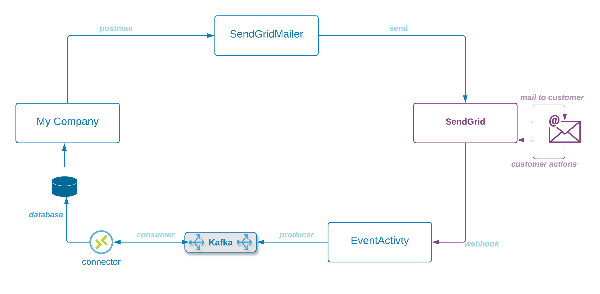

# Onboarding

Each of us has followed a different path in building our coding skills - and have different exposure to cross-cutting knowledge like code coverage, testing, sanity testing. 

In this onboarding project we'll cover the supporting disciplines that we need to take a software product to release. These are the disciplines that take software from an art to a product that people count on to "just work" 

### What are we building?
* A simple pipeline consisting of two micro-services, a client to the Twilio \(SendGrid\) email service, and a Kafka producer and consumer to ingest callback data from Twilio
* Users at MyCompany can post email requests to the SendGridMailer service
* The SendGridMailer sends a _Request_ to SendGrid, and receives a _Response_
* SendGrid creates an _EventActivity_ record when the customer bounces, opens, or clicks
* EventActivity records are sent to our EventActivity service
* They are then published to a Kafka message broker
* A Connector streams records out of Kafka and into a Database \(e.g. Snowflake, Athena, etc\)

---

### Components

| componnt | name | description |  |  |
| :--- | :--- | :--- | :--- | :--- |
| **SendGridMailer** | springboot-microservice | We'll build a rest-service that listens for request to send email, then formats and sends to SendGrid |  |  |
| **SendGrid** | n/a | An external service owned by Twilio that sends emails on behalf of its customers |  |  |
| **EventActivity** | webhook-service | We'll also build a second rest-service that accepts callbacks from SendGrid, and sends them to Kafka.   SendGrid provides asynchronous information about how the customer interacted with the email |  |  |
| **Confluent** | n/a | A high-volume message broker |  |  |
| **Kafka Consumer** | Connector | There are many ways to get information from Kafka to a database.  In this example we'll store the data to parquet data on AWS S3 |  |  |

