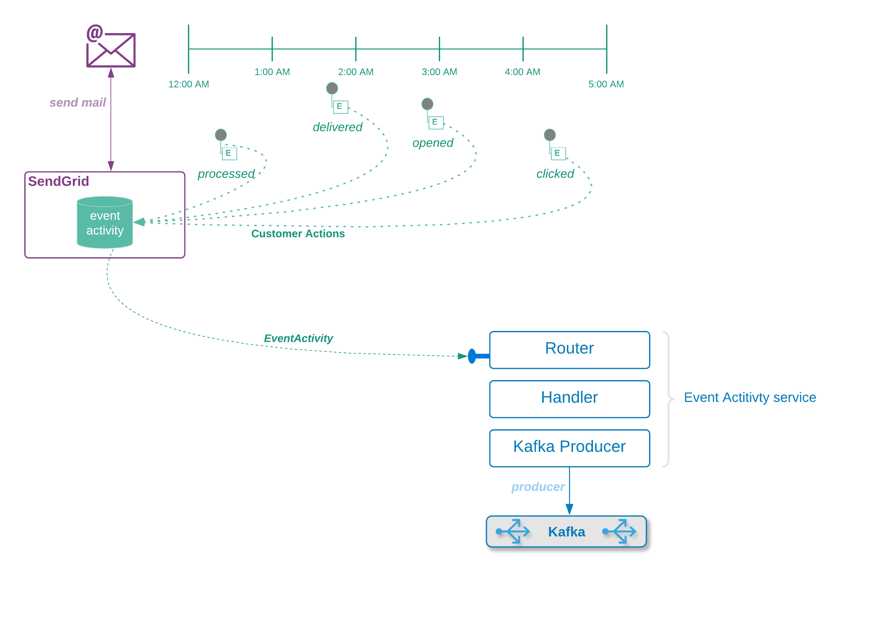

####What are we building

The (SendGrid) Event Activity service is a REST microservice that

* [x] accepts information from SendGrid's webhook service (SendGrid Webhooks)
* [x] publishes that information to a Kafka queue
* [x] performs minimal formatting of data or the payload
 
####Background
  When we submit a request to SendGrid we get an immediate response that the request was received.  We can also get asynchronous `event activity` messages from Sendgrid about the delivery progress and how the recipient interacted with the email.

In order to get these we need to set up a REST 'endpoint' that listens for the messages, and we need to tell Sendgrid to send the messages to our endpoint.

#### The basic flow
* [x] SendGrid completes processing of the request
* [x] The email makes it to the recipient (or not)
* [x] The recipient opens the email (or not)
* [x] The recipient clicks on any link that we've embedded in the email (or not)

####The event activity service

The `Event Activity` service will listen for these messages and store the raw data in Kafka for further processing.  Unlike the Sendgrid mailer service, we replace the controller with a reactive router so that we can explore testing that sort of service.  In the next few sections we'll

* [x] Do a brief walk-through of the code
* [x] Explore testng the reactive router 
* [x] Explore testing a message service client

