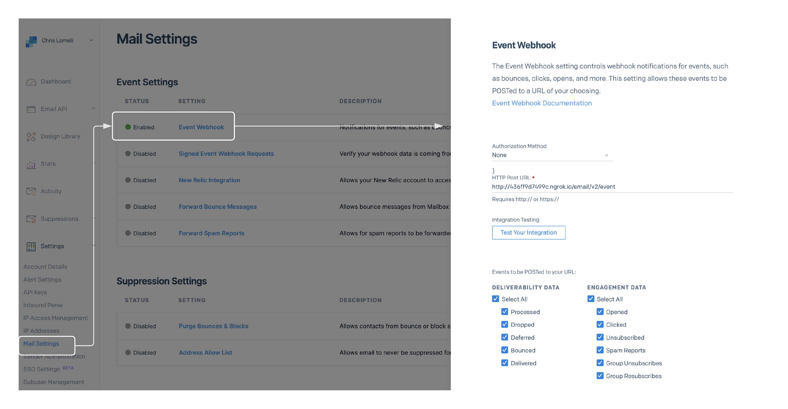

In order to run the solution without mocks we have two dependencies:
* [x] Provide Sendgrid with a public IP address that it can send event activity to 
* [x] Provide a Kafka broker to send our data to -- we'll use docker for this


---

####Setup Overview

* [ ] Download and install the wonderful **ngrok** proxy (instructions below)
* [ ] In the project root directory type **docker-compose up** - to start Kafka and Kowl (Kowl is a Kafka UI)
* [ ] Start up our **event activity** service listening on port 5000 (in this example)
* [ ] Start up the ngrok proxy and get the **Forwarding**  IP address in the output
* [ ] Log into **SendGrid** and configure the Sendgrid `webhook` to send event data to our ngrok Forwarding address.  
* [ ] Send some emails to ourselves -- use our **SendgridMailer** service or manually create an email in SendGrid
* [ ] Your email body can have a clickable link, so you can "click' on it when you get the email
* [ ] once you have received the email, log into **Kowl** at localhost:8080 to see the event activity
  * Kowl is a wonderful UI that lets us view our topics in Kafka
  * review the **sendgrid_events** topic
  * You should see the following records
    * processed
    * opened
    * click (if you clicked on the link in the email)

---

####Start up our service
In the project root directory type **docker-compose up** - to start Kafka and Kowl (Kowl is a Kafka UI)

You should be able to see the Kowl interface ku running on pot 8080

Next, run the event activity service listening on port 5000.  

At this point we are listening for messages on port 5000 and -- when we receive them -- we'll forward them on to Kafka.  But Sendgrid needs a public ip address to send messagefs to.   That's where ngrk comes in.

---

####Using ngrok
Ngrok provides a public IP address for us, and forwards any traffic it receives on that address to our local service.   

Start up the ngrok service -- giving it the port our event activity service is listening on (5000) and get the public  **Forwarding** IP address in the output.  ngrok will proxy any trafiic received on that address to our local service.

`prompt>` npx ngrok http 5000

```shell
ngrok by @inconshreveable                                                                                                                                                                                                                           (Ctrl+C to quit)

Session Status                online
Session Expires               1 hour, 59 minutes
Version                       2.3.40
Region                        United States (us)
Web Interface                 http://127.0.0.1:4040
Forwarding                    http://78e3-73-96-191-223.ngrok.io -> http://localhost:5000
Forwarding                    https://78e3-73-96-191-223.ngrok.io -> http://localhost:5000

Connections                   ttl     opn     rt1     rt5     p50     p90
                              0       0       0.00    0.00    0.00    0.00
```

in the example above ngrok is proxying public ip http://78e3-73-96-191-223.ngrok.io to our local event activity listener.

---

####Configure Sendgrid to send events
In the SendGrid account site navigate to:

>settings --> Mail Settings --> Event Webhook


And fill out the webhook form:
* [x] Authorization Method (leave blank)
* [x] HTTP Post URL (Use the ngrok public IP address)
* [x] Deliverability Data (select all)
* [x] Engagement Data (select all)



To be on the safe side also go to:

> settings--> Tracking

and set:
- Open Tracking on
- Click Tracking On

---

####Sample email
We can use the Sendgrid mailer service from the previous walk-through to send and email. 

```json
{
  "senderName": "me",
  "fromAddress": "sender@gmail.com",
  "toAddress": "receiver@gmail.com",
  "subject": "This is my email",
  "content": "Click here to generate a click event : http://www.google.com"

}
```
---

#### Viewing events

In a few minutes we should see events coming across our service, and if we open Kowl at port 8080 we'll see those events being saved in the `sendgrid_events` topic.

Sendgrid will return a batch of events - having different schemas -- on the event activity feed. We'll get this payload in the response body of our POST /events endpoint.


```json5
[
  {
    "email": "xxx@gmail.com",
    "event": "processed",
    "id": "30000",
    "send_at": 0,
    "sg_event_id": "cHJvY2Vzc2VkLTEyMDAxNDgyLUt1ZHFEVW8tUVg2bGxRSHJteHpNRVEtMA",
    "sg_message_id": "KudqDUo-QX6llQHrmxzMEQ.filterdrecv-66dddc765f-mbf8r-1-60F38A19-27.0",
    "smtp-id": "<KudqDUo-QX6llQHrmxzMEQ@geopod-ismtpd-3-0>",
    "timestamp": 1626573337
  },
  {
    "email": "xxxx@gmail.com",
    "event": "delivered",
    "id": "30000",
    "ip": "168.245.64.230",
    "response": "250 2.0.0 OK  1626573338 r9si15457369edq.454 - gsmtp",
    "sg_event_id": "ZGVsaXZlcmVkLTAtMTIwMDE0ODItS3VkcURVby1RWDZsbFFIcm14ek1FUS0w",
    "sg_message_id": "KudqDUo-QX6llQHrmxzMEQ.filterdrecv-66dddc765f-mbf8r-1-60F38A19-27.0",
    "smtp-id": "<KudqDUo-QX6llQHrmxzMEQ@geopod-ismtpd-3-0>",
    "timestamp": 1626573338,
    "tls": 1
  } 
]
```

