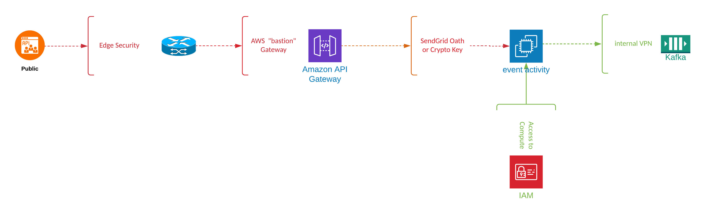
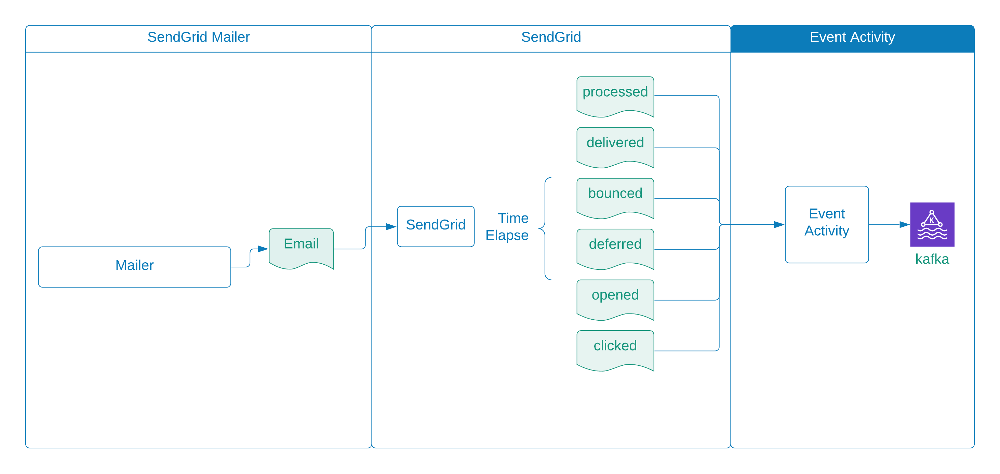

### This is a sample application

Some considerations for creating a production design would include the following topics that we will not cover in detail, but will provide examples below

---

#### Design Constraints

* [x] Communication must be via TLS
* [x] We can apply NO back-pressure - the SendGrid webhook solution is fire-and-forget
* [x] NO formatting, validation, or resource errors - this is a store-forward solution
* [x] If the Kafka is unavailable, we need a 'backup' plan
* [x] We have to secure our event activity service with either crypto or Oauth 2.0 signing

---

#### Threats
**Data**

* [x] PII - data (email address)
* [x] Production Access - IAM admin user only




**Security Milestones**

* [x] SendGrid calls our service over public internet
    * The packets are susceptible to network intrusion -- edge detection solution, firewalls
      * Malware
      * MitM
      * DDos
      * DNS
      * Ransomware
    * The data contains personal (PII) information  -- encrypt data with TLS
      * data taps
* [x] The Sendgrid payload structure is public 
  * Phishing
* [x] AWS internal access security - data access
  * Unauthorized access


**Security Features**

* [x] TLS communication channel - prevents taps
* [x] Public access via `edge` routers - prevents intrusions
* [x] Firewalled Gateway Servers - intrusion
* [x] Application crypto token or Oath prevents phishing, spoofing
* [x] AWS internal access security - secure internal data access

---

###Data Flow
* [x] We send email requests to SendGrid 
* [x] SendGrid send emails on our behalf
* [x] SendGrid sends asynchronous updates in the form of events
* [x] The Event Activity services listens for these events
* [x] and stores them to Kafka


---
####Data Schema
[Link: SendGrid Event schema](https://docs.sendgrid.com/for-developers/tracking-events/event#event-objects)
Event Activity Schema
<details>

```json
{
  "type": "record",
  "name": "EventActivity",
  "namespace": "com.tinyengines.twillio",
  "fields": [
    {
      "name": "email",
      "type": [
        "null",
        {
          "items": "string",
          "avro.java.string": "String"
        }
      ],
      "default": null,
      "doc": "the email address of the recipient",
      "avro.java.string": "String"
    },
    {
      "name": "timestamp",
      "type": [
        "null",
        "long"
      ],
      "default": null,
      "doc": "UNIX timestamp the event took place",
      "avro.java.string": "String"
    },
    {
      "name": "event",
      "type": [
        "null",
        {
          "type": "string",
          "avro.java.string": "String"
        }
      ],
      "default": null,
      "doc": "the event type e.g. processed, dropped, delivered, deferred, bounce, open, click, spam report, unsubscribe, group unsubscribe, and group resubscribe",
      "avro.java.string": "String"
    },
    {
      "name": "send_id",
      "type": [
        "null",
        {
          "type": "string",
          "avro.java.string": "String"
        }
      ],
      "default": null,
      "doc": "Nike NCP send id",
      "avro.java.string": "String"
    },
    {
      "name": "assembly_id",
      "type": [
        "null",
        {
          "type": "string",
          "avro.java.string": "String"
        }
      ],
      "default": null,
      "doc": "Nike NCP assembly ID",
      "avro.java.string": "String"
    },
    {
      "name": "cp_code",
      "type": [
        "null",
        {
          "type": "string",
          "avro.java.string": "String"
        }
      ],
      "default": null,
      "doc": "Nike NCP cp code",
      "avro.java.string": "String"
    },
    {
      "name": "comm_id",
      "type": [
        "null",
        {
          "type": "string",
          "avro.java.string": "String"
        }
      ],
      "default": null,
      "doc": "Nike NCP comm_id",
      "avro.java.string": "String"
    },
    {
      "name": "smtp-id",
      "type": [
        "null",
        {
          "type": "string",
          "avro.java.string": "String"
        }
      ],
      "default": null,
      "doc": "a unique ID attached to the message by the originating system",
      "avro.java.string": "String"
    },
    {
      "name": "category",
      "type": [
        "null",
        {
          "type": "array",
          "items": "string",
          "avro.java.string": "String"
        }
      ],
      "default": null
    },
    {
      "name": "sg_event_id",
      "type": [
        "null",
        {
          "type": "string",
          "avro.java.string": "String"
        }
      ],
      "default": null,
      "doc": "a unique ID to this event that you can use for deduplication purposes. These IDs are up to 100 characters long and are URL safe",
      "avro.java.string": "String"
    },
    {
      "name": "sg_message_id",
      "type": [
        "null",
        {
          "type": "string",
          "avro.java.string": "String"
        }
      ],
      "default": null,
      "doc": "a unique, internal SendGrid ID for the message. The first half of this ID is pulled from the smtp-id",
      "avro.java.string": "String"
    },
    {
      "name": "sg_content_type",
      "type": [
        "null",
        {
          "type": "string",
          "avro.java.string": "String"
        }
      ],
      "default": null,
      "doc": "sendgrid content type from open event",
      "avro.java.string": "String"
    },
    {
      "name": "ip",
      "type": [
        "null",
        {
          "type": "string",
          "avro.java.string": "String"
        }
      ],
      "default": null,
      "doc": "the IP address used to send the email. For open and click events, it is the IP address of the recipient who engaged with the email",
      "avro.java.string": "String"
    },
    {
      "name": "type",
      "type": [
        "null",
        {
          "type": "string",
          "avro.java.string": "String"
        }
      ],
      "default": null,
      "doc": "indicates whether the bounce event was a hard bounce (type=bounce) or block (type=blocked)",
      "avro.java.string": "String"
    },
    {
      "name": "url",
      "type": [
        "null",
        {
          "type": "string",
          "avro.java.string": "String"
        }
      ],
      "default": null,
      "doc": "the URL where the event originates. For click events, this is the URL clicked on by the recipient",
      "avro.java.string": "String"
    },
    {
      "name": "reason",
      "type": [
        "null",
        {
          "type": "string",
          "avro.java.string": "String"
        }
      ],
      "default": null,
      "doc": "any sort of error response returned by the receiving server that describes the reason this event type was triggered",
      "avro.java.string": "String"
    },
    {
      "name": "status",
      "type": [
        "null",
        {
          "type": "string",
          "avro.java.string": "String"
        }
      ],
      "default": null,
      "doc": "status code string. Corresponds to HTTP status code - for example, a JSON response of 5.0.0 is the same as a 500 error response",
      "avro.java.string": "String"
    },
    {
      "name": "response",
      "type": [
        "null",
        {
          "type": "string",
          "avro.java.string": "String"
        }
      ],
      "default": null,
      "doc": "the full text of the HTTP response error returned from the receiving server",
      "avro.java.string": "String"
    },
    {
      "name": "attempt",
      "type": [
        "null",
        {
          "type": "string",
          "avro.java.string": "String"
        }
      ],
      "default": null,
      "avro.java.string": "String",
      "doc": "attempt value where event is deferred"
    },
    {
      "name": "asm_group_id",
      "type": [
        "null",
        {
          "type": "string",
          "avro.java.string": "String"
        }
      ],
      "default": null,
      "avro.java.string": "String"
    },
    {
      "name": "useragent",
      "type": [
        "null",
        {
          "type": "string",
          "avro.java.string": "String"
        }
      ],
      "default": null,
      "avro.java.string": "String"
    }
  ]
}

```
</details>

---

**Payload Example**
A single payload will contain an array of event activity records.

<details>

```json
[
  {
    "email": "chris@gmail.com",
    "event": "processed",
    "send_id": "30000",
    "assembly_id": "40000",
    "cp_code": "50000",
    "comm_id": "60000",
    "send_at": 0,
    "sg_event_id": "cHJvY2Vzc2VkLTEyMDAxNDgyLUt1ZHFEVW8tUVg2bGxRSHJteHpNRVEtMA",
    "sg_message_id": "KudqDUo-QX6llQHrmxzMEQ.filterdrecv-66dddc765f-mbf8r-1-60F38A19-27.0",
    "smtp-id": "<KudqDUo-QX6llQHrmxzMEQ@geopod-ismtpd-3-0>",
    "timestamp": 1626573337
  },
  {
    "email": "chris@gmail.com",
    "event": "delivered",
    "send_id": "30000",
    "assembly_id": "40000",
    "cp_code": "50000",
    "comm_id": "60000",
    "ip": "168.245.64.230",
    "response": "250 2.0.0 OK  1626573338 r9si15457369edq.454 - gsmtp",
    "sg_event_id": "ZGVsaXZlcmVkLTAtMTIwMDE0ODItS3VkcURVby1RWDZsbFFIcm14ek1FUS0w",
    "sg_message_id": "KudqDUo-QX6llQHrmxzMEQ.filterdrecv-66dddc765f-mbf8r-1-60F38A19-27.0",
    "smtp-id": "<KudqDUo-QX6llQHrmxzMEQ@geopod-ismtpd-3-0>",
    "timestamp": 1626573338,
    "tls": 1
  },
  {
    "email": "chris@gmail.com",
    "event": "open",
    "send_id": "30000",
    "assembly_id": "40000",
    "cp_code": "50000",
    "comm_id": "60000",
    "ip": "66.249.91.8",
    "sg_content_type": "html",
    "sg_event_id": "AB2eCjZYSSOKerbJry49Uw",
    "sg_message_id": "2KoVJuIYQk-4xff6b8xcMA.filterdrecv-574dbbbf6c-gwwcr-1-60F38B05-32.0",
    "timestamp": 1626573576,
    "useragent": "Mozilla/5.0 (Windows NT 10.0; Win64; x64) AppleWebKit/537.36 (KHTML, like Gecko) Chrome/42.0.2311.135 Safari/537.36 Edge/12.246 Mozilla/5.0"
  },
  {
    "email": "example@test.com",
    "timestamp": 1631577204,
    "smtp-id": "<14c5d75ce93.dfd.64b469@ismtpd-555>",
    "event": "processed",
    "category": [
      "cat facts"
    ],
    "sg_event_id": "LByNAbjQOn0PqfXwvqg1Aw==",
    "sg_message_id": "14c5d75ce93.dfd.64b469.filter0001.16648.5515E0B88.0"
  },
  {
    "email": "example@test.com",
    "timestamp": 1631577204,
    "smtp-id": "<14c5d75ce93.dfd.64b469@ismtpd-555>",
    "event": "deferred",
    "category": [
      "cat facts"
    ],
    "sg_event_id": "lE8e4z_vcWKwAcsIW6oIYA==",
    "sg_message_id": "14c5d75ce93.dfd.64b469.filter0001.16648.5515E0B88.0",
    "response": "400 try again later",
    "attempt": "5"
  },
  {
    "email": "example@test.com",
    "timestamp": 1631577204,
    "smtp-id": "<14c5d75ce93.dfd.64b469@ismtpd-555>",
    "event": "delivered",
    "category": [
      "cat facts"
    ],
    "sg_event_id": "rPoZ4mHajV0Try7IXg--Yw==",
    "sg_message_id": "14c5d75ce93.dfd.64b469.filter0001.16648.5515E0B88.0",
    "response": "250 OK"
  },
  {
    "email": "example@test.com",
    "timestamp": 1631577204,
    "smtp-id": "<14c5d75ce93.dfd.64b469@ismtpd-555>",
    "event": "open",
    "category": [
      "cat facts"
    ],
    "sg_event_id": "_o7lppLso10WRMDfPuqlFQ==",
    "sg_message_id": "14c5d75ce93.dfd.64b469.filter0001.16648.5515E0B88.0",
    "useragent": "Mozilla/4.0 (compatible; MSIE 6.1; Windows XP; .NET CLR 1.1.4322; .NET CLR 2.0.50727)",
    "ip": "255.255.255.255"
  },
  {
    "email": "example@test.com",
    "timestamp": 1631577204,
    "smtp-id": "<14c5d75ce93.dfd.64b469@ismtpd-555>",
    "event": "click",
    "category": [
      "cat facts"
    ],
    "sg_event_id": "tV-c4nwCoXQaCTmGiPEvIA==",
    "sg_message_id": "14c5d75ce93.dfd.64b469.filter0001.16648.5515E0B88.0",
    "useragent": "Mozilla/4.0 (compatible; MSIE 6.1; Windows XP; .NET CLR 1.1.4322; .NET CLR 2.0.50727)",
    "ip": "255.255.255.255",
    "url": "http://www.sendgrid.com/"
  },
  {
    "email": "example@test.com",
    "timestamp": 1631577204,
    "smtp-id": "<14c5d75ce93.dfd.64b469@ismtpd-555>",
    "event": "bounce",
    "category": [
      "cat facts"
    ],
    "sg_event_id": "Q8veIbXiPcpkSH1rCi_8Sw==",
    "sg_message_id": "14c5d75ce93.dfd.64b469.filter0001.16648.5515E0B88.0",
    "reason": "500 unknown recipient",
    "status": "5.0.0"
  },
  {
    "email": "example@test.com",
    "timestamp": 1631577204,
    "smtp-id": "<14c5d75ce93.dfd.64b469@ismtpd-555>",
    "event": "dropped",
    "category": [
      "cat facts"
    ],
    "sg_event_id": "YLLRhu9oXHKXY6fqdL0r2A==",
    "sg_message_id": "14c5d75ce93.dfd.64b469.filter0001.16648.5515E0B88.0",
    "reason": "Bounced Address",
    "status": "5.0.0"
  },
  {
    "email": "example@test.com",
    "timestamp": 1631577204,
    "smtp-id": "<14c5d75ce93.dfd.64b469@ismtpd-555>",
    "event": "spamreport",
    "category": [
      "cat facts"
    ],
    "sg_event_id": "uIhZz5hC-AH2bHZpzitUxw==",
    "sg_message_id": "14c5d75ce93.dfd.64b469.filter0001.16648.5515E0B88.0"
  },
  {
    "email": "example@test.com",
    "timestamp": 1631577204,
    "smtp-id": "<14c5d75ce93.dfd.64b469@ismtpd-555>",
    "event": "unsubscribe",
    "category": [
      "cat facts"
    ],
    "sg_event_id": "l0vMnu-FvYjc2EcDXg4SOA==",
    "sg_message_id": "14c5d75ce93.dfd.64b469.filter0001.16648.5515E0B88.0"
  },
  {
    "email": "example@test.com",
    "timestamp": 1631577204,
    "smtp-id": "<14c5d75ce93.dfd.64b469@ismtpd-555>",
    "event": "group_unsubscribe",
    "category": [
      "cat facts"
    ],
    "sg_event_id": "kC3QpKDvQeH4PjAvnQFA_A==",
    "sg_message_id": "14c5d75ce93.dfd.64b469.filter0001.16648.5515E0B88.0",
    "useragent": "Mozilla/4.0 (compatible; MSIE 6.1; Windows XP; .NET CLR 1.1.4322; .NET CLR 2.0.50727)",
    "ip": "255.255.255.255",
    "url": "http://www.sendgrid.com/",
    "asm_group_id": 10
  },
  {
    "email": "example@test.com",
    "timestamp": 1631577204,
    "smtp-id": "<14c5d75ce93.dfd.64b469@ismtpd-555>",
    "event": "group_resubscribe",
    "category": [
      "cat facts"
    ],
    "sg_event_id": "s8baRlfcA4FmfU83dW1Zmg==",
    "sg_message_id": "14c5d75ce93.dfd.64b469.filter0001.16648.5515E0B88.0",
    "useragent": "Mozilla/4.0 (compatible; MSIE 6.1; Windows XP; .NET CLR 1.1.4322; .NET CLR 2.0.50727)",
    "ip": "255.255.255.255",
    "url": "http://www.sendgrid.com/",
    "asm_group_id": 10
  }
]


```

</details>