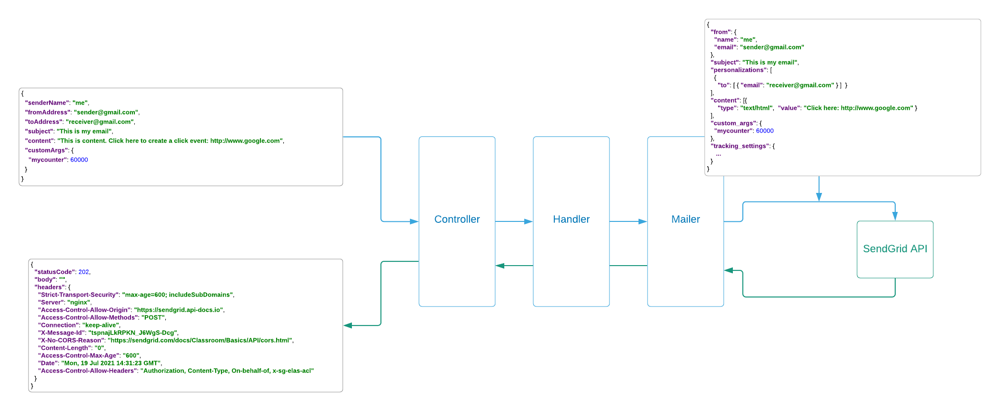

# The Sendgrid mailer service


Get the code at: [Github](https://github.com/tiny-engines-code/springboot-microservice-walkthrough)


### What is in this section
We'll cover our first service in this section.  We'll provide a quick overview of the service in this page, then dive in the following sections:

* [x] code walk-through
* [x] unit testing
* [x] high-level testing, such as integration and acceptance testing
* [x] code quality

---
### High level design
Our first service is a basic blocking spring boot java rest service that receives a simple request to send an email to some recipient.  The service should:

* [x] Accept a simple json payload
* [x] Validate the json format and the input data
* [x] Generate a SendGrid API http request object and sends the request to the SendGrid API
* [x] Receive a Response object back from SendGrid and passes it back 
* [x] Make sure that any exception or edge case is captured and the user always sees an appropriate Response

---

### Components

**SendgridController (Controller)**
  1. accepts the json request
  2. passes it to the SendgridHandler
  3. Receives a Response and displays it ot the user

**SendgridHandler (Handler)**
  1. receives the json request from the controller
  2. validates the json
  3. passes it as a SendgridRequest object to the SendgridMailer
  4. receives the Response from the Mailer and sends it back to the Controller

**SendgridMailer (Mailer)**
1. receives the SendgridRequest from the Handler
2. validates the data
3. reformats it to a SendGrid Request object
4. Sends the Request to the SendGrid API
5. receives the Response from the API and sends it back to the Handler

