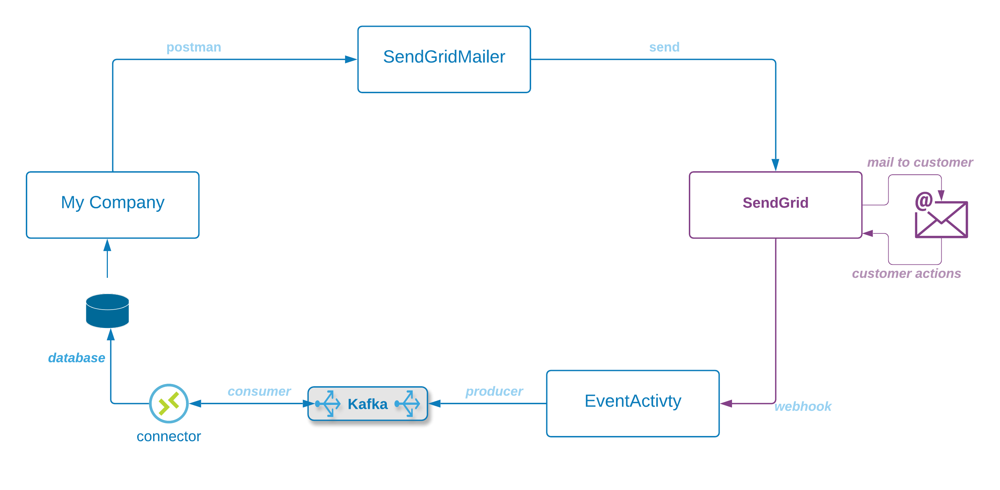

# What Are we building?

### Basic Flow

* Users at MyCompany can post email requests to the SendGridMailer service 
* The SendGridMailer sends a _Request_ to SendGrid, and receives a _Response_
* SendGrid creates an _EventActivity_ record when the customer bounces, opens, or clicks
* EventActivity records are sent to our EventActivity service
* They are then published to a Kafka message broker
* A Connector streams records out of Kafka and into a Database \(e.g. Snowflake, Athena, etc\)

---

### Components

| component | name | description |
| :--- | :--- | :--- |
| springboot-microservice                   | **SendGridMailer** | We'll build a rest-service that listens for request to send email, then formats and sends to SendGrid |
| SendGrid | **Sendgrid** | An external service owned by Twilio that sends emails on behalf of its customers |
| webhook-service | **EventActivity** | We'll also build a second rest-service that accepts callbacks from SendGrid, and sends them to Kafka.   SendGrid provides asynchronous information about how the customer interacted with the email |
| Confluent | **Kafka** | A high-volume message broker |
| Connector | **Kafka Consumer** | There are many ways to get information from Kafka to a database.  In this example we'll store the data to parquet data on AWS S3 |

