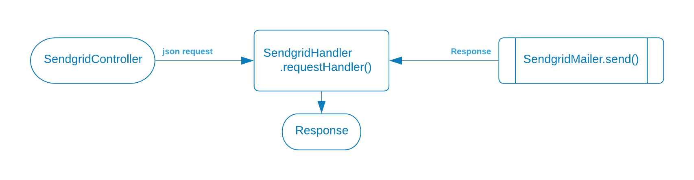

# Unit testing the SendgridHandler


The SendgridHandler:

* [ ] Receives a JSON string from the SendgridController
* [ ] Calls the .send() function of the SendgridMailer class
* [ ] Returns a Sendgrid Response object as its response to the caller
* [ ] Passes the Response object back to the SendgridController





<p/><strong>he function accepts a JSON request bodyn</strong>

* The **json** can be correct or incorrect
* A "good" json string is converted to a SendgridRequest object


<p/><strong>It calls the SendgridMailer program</strong>

* It passes the SendgridRequest to the SendgridMailer.send() function


<p/><strong>What kind of response could we possibly get back from SendgridMailer?</strong>

* a Sendgrid Response object
* a Runtime exception
* a null Response object


---
#### Testing the json conversion

We don't have many scenarios to cover.  The conversion will either fail or succeed for any number of reasons.   If it fails we want to return a BAD\_REQUEST.
* Json conversion - converts the json string to a SendgridRequest bean
   1. handle good conversions
   2. handle exceptions

```java
@Test
void test_handle_null_input_returns_400() throws Exception {
    var response = new SendgridHandler(new SendGridMailer())
                            .requestHandler(null);
                            
    assertThat(
        response.getStatusCode())
          .isEqualTo(HttpStatus.BAD_REQUEST.value());
}
```


---
#### Testing the SendgridMailer response

The repeatable pattern for all SendgridMailer returns is to mock the return we are trying to test, then test for the expected results.
* Handle the SendgridMailer.send() responses
   1. handle all status codes
   2. handle any exceptions



```java
@Test 
void handles_requestHandler_null() throws Exception {
    // mock the mailer
    var sendGridMailer = mock(SendGridMailer.class);
    when(sendGridMailer.send(any(SendgridRequest.class)))
            .thenThrow(new RuntimeException("Badd JuJu"));
    
    // execute
    var response = new SendgridHandler(sendGridMailer)
                            .requestHandler(createRequest());
    // test output
    assertAll(
         () -> assertEquals(response.getStatusCode(), HttpStatus.INTERNAL_SERVER_ERROR.value()),
         () -> assertEquals("Badd JuJu", response.getBody())
    );
}
```


