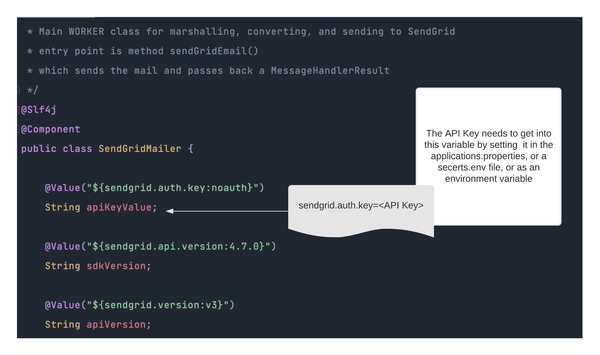

# Running the Microservice

### Prerequisites

In order to run the code for ourselves we need to

* [ ] create a sendgrid account
* [ ] create an API key for the sendgrid account
* [ ] download or clone the repository
* [ ] export the API key property as **sendgrid.auth.key**
* [ ] be able to use Postman or curl to send a user request

### Using the API Key

The API Key needs to be inserted as a value in the SendGridMailer. 



There are a few ways to do this.  Setting up spring boot configurations is beyond the scope of this walkthrough, but generally:

* place it into the application.properties resource file
* declare it as an Environment variable
  * on the command line, or
  * in an ".env" file 

```
sendgrid.auth.key="<my api key>"
```

### Running the service

* [ ] Start the microservice locally 
* [ ] If you are using the application.properties file - then you will be listening on port 5000
* [ ] Use curl or Postman to send a user request


Make sure the proper headers are set !  Content-type should be 'application/json'

```javascript
POST /email/v2/send HTTP/1.1
Host: localhost:5000
Content-Type: application/json
Content-Length: 269
```


