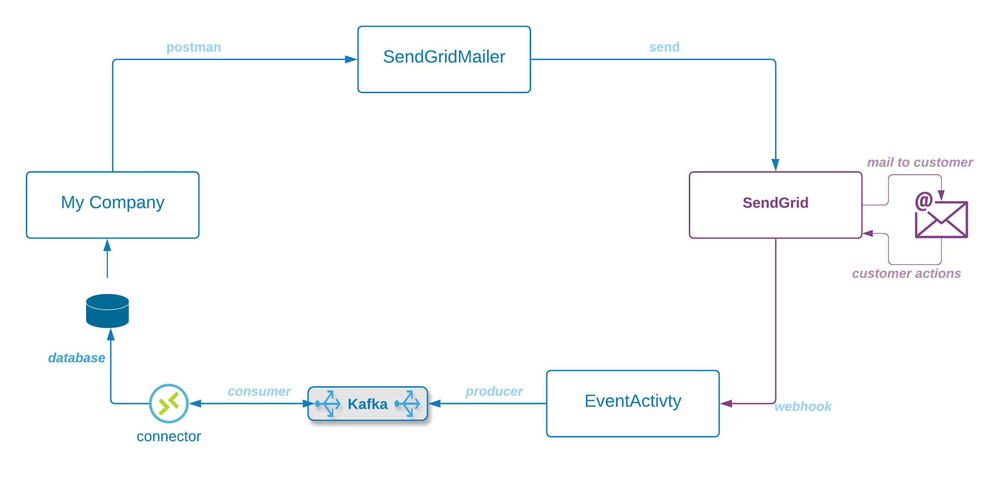

To provide continuity across the concepts I'm covering I'll use a simple 'textbook' solution to illustrate some cross-cutting components of a complete production deliverable.

#### What are we building?

We'll' focus on a simple pipeline consisting of:
* [x] A blocking REST service that sends emails to a vendor (SendGrid) who then sends them to customers
* [x] A webhook listener that receives information back from the vendor and stores it in Kafka
* [x] A connector that streams records out of Kafka and into a Database
* [x] A pyspark "sweeper" utility that picks up Dead Letter data in AWS S3 and stores it for use in AWS Athena

#### Components

|**Component** | **Description** |  
| :--- | :--- |
| SendGridMailer | Our rest-service that listens for request to send email, then formats and sends to SendGrid |  |  
| SendGrid | An external service owned by Twilio that sends emails on behalf of its customers and then provides asynchronous information about how the customer interacted with the email|  |  
| EventActivity | Our second rest-service that accepts callbacks from SendGrid, and sends them to Kafka.    |  |  
| Confluent Kafka | A high-volume message broker |  |  
| Connector | There are many ways to get information from Kafka to a database.  In this example we'll store the data to parquet data on AWS S3 |  |  

