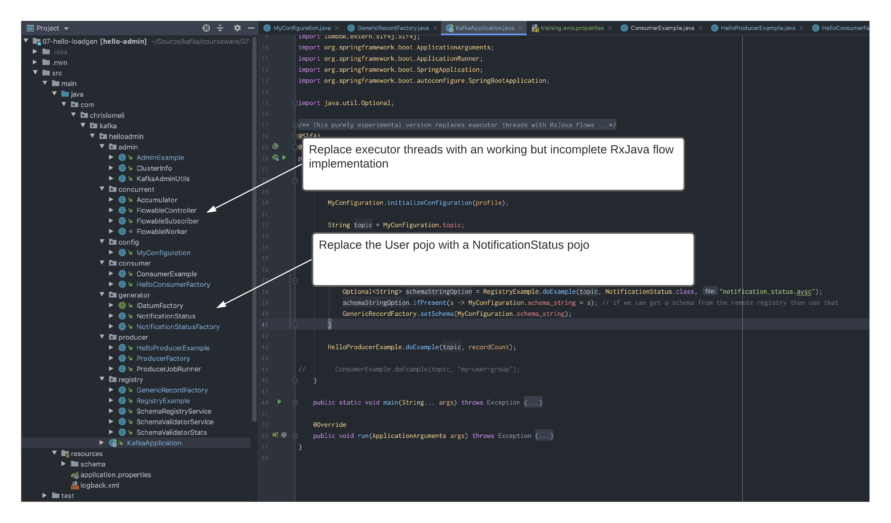

# Work in progress


Code is stored at: [Github](https://github.com/tiny-engines-code/kafka-course-material)


---
###01-hello-kafka
This is a version of the Confluent sample program, except that the configurations are in a separate file.  We won't spend a lot of time on this except to run the program and make sure that we can all produce records to Kafka.

* Run the program against the training server
* Run the program against Confluent
* IConfluentect the data in Confluent using the Control Center or the Kafka-utils tool
* Change the record count and run again

---
###02-hello-kafka-again
We'll dig into the basics of producing and consuming simple text messages to Kafka.

* Walk through the Producer configurations
* Introduction to the KafkaProducer class
* Walk through the Consumer properties
* Introduction to the KafkaConsumer class
* Run the program 
* Change the record count and run again
   

---

###03-hello-admin
Use the AdminClient functionality to get and create topics.   
We've also separated configuration from logical code.  
* Walk through the admin code
* Run the program and create a new topic in the training environment

---

###04-hello-json
Introduce the concept of serializers and how they are implemented in Kafka.

* IConfluentect the Json serializer and the changes to Producer and consumer configurations
* Walk through the generator pojo and factory
* Run the program for the Training broker
* IConfluentect the data in Confluent using the Control Center or the Kafka-utils tool
* Run the program 

---
###05-hello-json (perfs)
Quickly walk through the executor thread setup - the important takeaway here is that we share the producer across threads.

* IConfluentect the threaded producer

* 

---
###06-hello-avro

Why Avro?

* Explain automated 'sinks' like KafkaConnect that require schema
* Walk through a KafkaConnect example

Schema Registry

* Emphasis that Kafka is only storing binary schema-less data
* Explain the general concept of schema
* Explain the schema registry
* Schema naming strategy

Confluent Schema-Registry API
* Generic vs Specific records

* Explain Specific vs Generic records
* Quickly review a Specific record implementation
* Deep dive into the generic record implementation
* Run the program against the Confluent broker
* Kafka serialization internals

Optionally walk through KafkaAvro serializer logic
###

---
###07-hello-loadgen

 The same basic material as version 06, but replace the User pojo with a NotificationStatus pojo, and substitute executor threads with a reactive approach (just for fun).
 

---
###08-kafka-spring (json)
 Spring offers an implementation of Kafka that hides some boilerplate code.  Revisit the 04-hello-json solution and re-write using spring-kafka
 
SpringCloud offers an even simpler generic interface
   

---

###09-kafka-spring (avro)
Revisit the 06-hello-avro solution and re-write using spring-kafka 

* Walk through all of the Spring producer code
* Run the program

