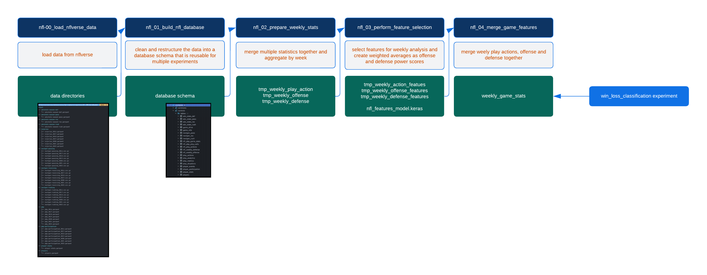
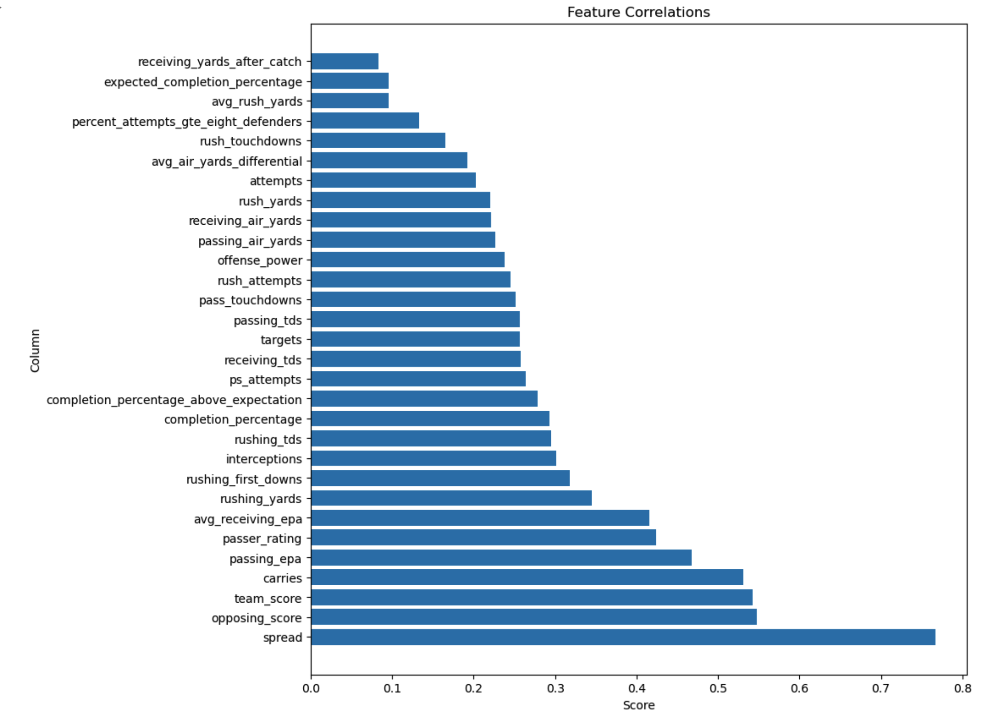
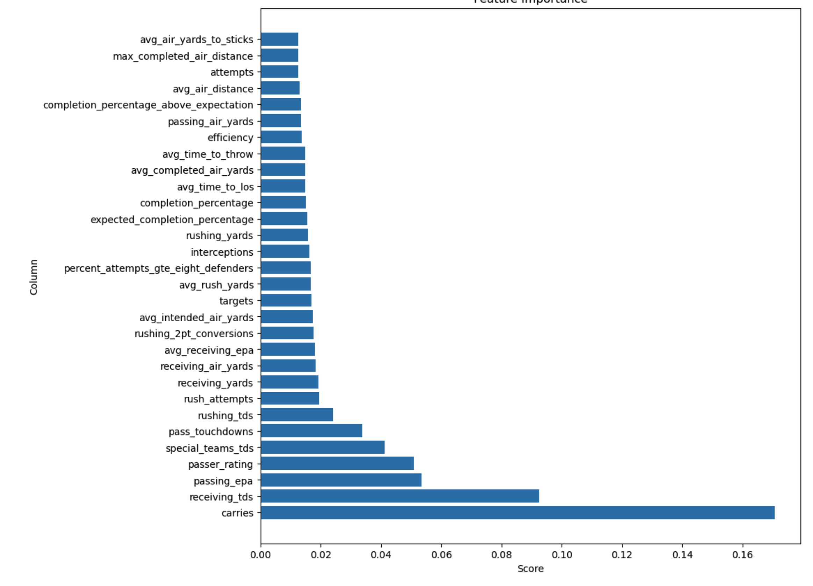
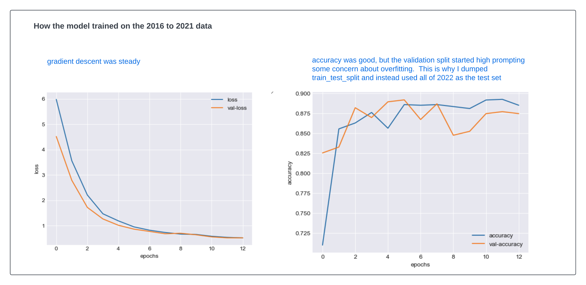
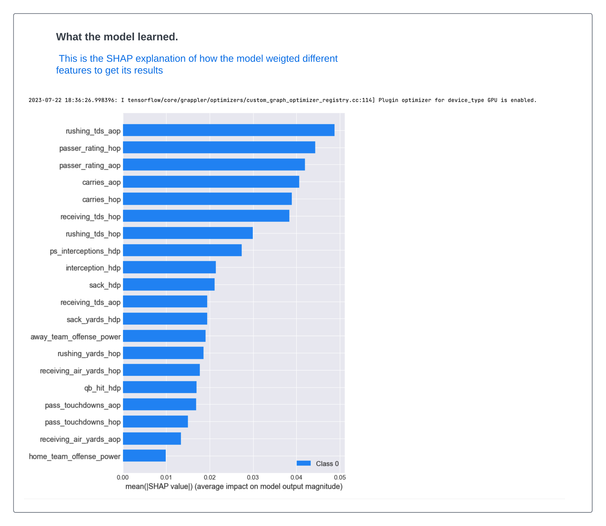
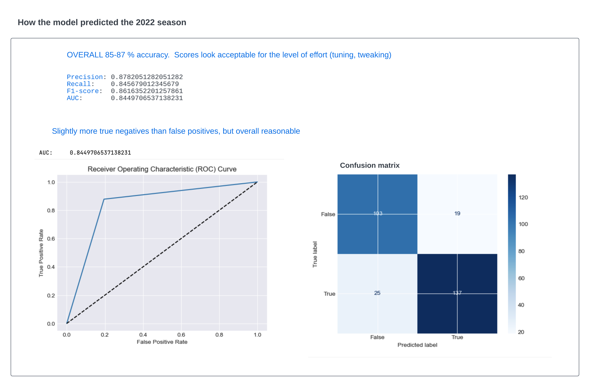

# Table of contents
- [Introduction](#introduction)
- [The nflverse data](#the-nflverse-data)
- [ETL workflows](#etl-workflows)
  - [Stubs and shortcuts](#stubs-and-shortcuts)
  - [ETL jobs](#etl-jobs)
  - [The workflow](#the-workflow)
  - [Reading the nflverse data](#reading-the-nflverse-data)
- [Database creation](#database-creation)
  - [Database design](#database-design)
  - [Significant conversions](#significant-conversions)
  - [Play by play (pbp)](#play-by-play-pbp)
  - [Play actions](#play-actions)
  - [Player events](#player-events)
  - [Player_participation](#player_participation)
- [Feature selection](#feature-selection)
  - [create weekly offense and defense stats](#create-weekly-offense-and-defense-stats)
  - [use sklearn for correlation to the target (win/loss) column](#use-sklearn-for-correlation-to-the-target-winloss-column)
  - [use XGBoost for feature importance](#use-xgboost-for-feature-importance)
  - [merge the new offense and defense features with the core play-by-play data](#merge-the-new-offense-and-defense-features-with-the-core-play-by-play-data)
- [Modeling](#modeling)
  - [Experiment 1 - predict play calling](#experiment-1---predict-play-calling)
  - [Experiment 2 - predict wins and losses](#experiment-2---predict-wins-and-losses)


# Introduction
In this write-up I'm going to share my journey to use machine learning to analyse NFL games.   I know that's a bit vague, but I'll explain. This project is more about exploration than anything else. I am fascinated with AI and machine learning, and although I'm not interested in betting on games, I am interested in the application of machine learning to real-life challenges - such as NFL sports - which is another guilty pleasure for me personally.  

I'm going to cover the following:
- Understand the data and it's limitations at a very high level
- Dig into the data and break it up into more useable (for me) datasets, so I can query for any number of experiments requiring different levels of aggregation
- Go for broke and try to use that data for predicting play calling - whether a team will pass or run based on the down, distance and field position
- If that doesn't work right away, then aggregate the data to the game level and see if I can predict wins and losses.  The goal there is harder, but the implementation is simpler, the outcome is more measurable (the team either wins or loses) and our goal is just to prove the concept that the data can produce any insights using a simple machine learning model.

Spoiler alert.  I was not able to experiment 1 - predict play calling.  I'll explain why I think that is, and what I would do differently next time.  Experiment 2 - game wins and losses experiment - had better success.


# The nflverse data
For data, I looked at a few options and ultimately decided to stick to the NFLVerse data set, which is a collection of data sets that contain play by play data for every NFL game since 2016.  The data set is available from the nflverse GitHub site: https://nflverse.r-universe.dev/nflversedata.  It's a great body of data and represents the hard and smart work of a few contributors.  It's obvious that a lot of time and effort has gone into providing a nice dataset.

Here's thier GitHub site: [GitHub repository](https://github.com/nflverse)

Nflverse provides a wide variety of table and schemas ranging from a play-by-play breakdown to which officials participated in which games.  The site is large and I found it a little difficult to navigate, but the basic data can be found here: [nflverse data](https://github.com/nflverse/nflverse-data/releases).   They also provide schemas for the data, which is very helpful.  I've stored a copy of the schemas in this project under the /docs folder because I can't seem to find them again after first discovering them. The data itself is provided in a wide format, which is sensible for publishing, but I think needs to be transformed to perform any experiments.  I'll explain why later.

The data that I decided to use for this initial projects was:

|data| description|
| --- | --- | 
| pbp (play-by-play)  | Play-by-play data from the nflverse package | 
| pbp_participation | For each play this provide the arrays of offense and defense plays on that play |
| player_stats | Provides statistics for each player  |
| players| Player position and ID mappings  | |
| injuries | Player injuries |
| nextgen stats | Next gen stats for passing and rushing - I thought that receiving an passing would be redundant for my pupose|
| pfr_advstats  | Advanced stats from pro-football-reference.com | 


My copy of the nflverse schemas (I can't locate the nflverse originals) is here:  [nflverse schemas](https://github.com/cjlcoursework/nflverse_project/tree/14786c6c93beb48f63fd321036c0f2882376921b/doc/nflverse_schemas)


# ETL

## Stubs and shortcuts
A software implementation will typically have a few common side-cars that are not part of the core implementation but are necessary for the software to run.  These are things like configuration, logging, alerts, etc.  I'm not going to spend a lot of time on these because they are not the focus of the project. 

I'm just going to use some very simple stubs and shortcuts to get the job done.  I'll list them here, but I won't go into detail.
- **configuration** - I'm just using one very rudimentary configuration python configuration file: [config.py](https://github.com/cjlcoursework/nflverse_project/blob/14786c6c93beb48f63fd321036c0f2882376921b/src/configs.py)
- **alerts** - incidents are all sent to subroutines that don't do anythin but log to the console
- **logging** - I'm just using the python logging library to log to the console
- **streaming** - I'm not using any streaming or messaging services
- **API** - I'm not creating any API's yet, but as a next step I do plan to create a simple API to serve the model. I'll re-use existing games to feed the API a game at a time. I've already used those games for my test set, so we'll just be able to test the mechanics of the API, not the model itself.

## ETL Jobs
The ETL for this project is 'job' focused, meaning that downloading, imputing, and validating the nflverse files happens in Python code autonomously without manual intervention.  The ETL is orchestrated by the nfl_main.py script, which is also meant to run autonomously.

One can argue that feature selection is not really an ETL job, but I'm going to include it because it is automated at this point and could be a source of validation when I re-pull the data from nflverse - the 'best' features should remain the same - or else the model may have drifted.  

There are two 'ETL' notebooks provided with this project (nfl_load_nflverse_data_demo.ipynb and nfl_perform_feature_selection_demo.ipynb). They are meant as a demo of the ETL job steps. They are just calling job steps manually.  And they overlap:  nfl_perform_feature_selection_demo is re-running the feature selection job for additional visuals.

Find them in the notebooks section of the project: [notebooks](https://github.com/cjlcoursework/nflverse_project/tree/14786c6c93beb48f63fd321036c0f2882376921b/notebooks)


## ETL Workflow
There are five overall steps to the ETL job:

- [x] download the data: `read_nflverse_datasets()` - this is the main job that downloads the data from nflverse
- [x] create the database: `create_nfl_database()` - this job creates the database and tables
- [x] prepare the weekly stats `prepare_team_week_dataset()` - this job merges the data into a single dataset
- [x] perform feature selection `perform_team_week_feature_selection()` - this job performs feature selection on the data
- [x] merge the features `merge_team_week_features()` - this job merges the features with the core play-by-play data



These steps slot into two major jobs:

The first is getting the data from nflverse into local 'data-at-rest'.  This is a two step process:
1. download the data: `read_nflverse_datasets()` - this is the main job that downloads the data from nflverse
2. create the database: `create_nfl_database()` - this job creates the database and tables

Why do we need a database?  It's an arguable choice, but the data needs to 'serve' several different experiments.  In any of those experiences we would need to split up the monolithic datasets into more joinable sets that are the right level of cardinality and for which the imputations and other cleaning steps are not changing.  So rather than having a overly complex filesystem I'm creating a small data 'pond' for this project. 

Once we have the data in an NFL database, we can query and prepare the data for experiments as outlined in the code block below.  I'm going to focus on experiment 2 at this point.  We prepare for the experiment 2 model in three steps:
1. prepare the weekly stats `prepare_team_week_dataset()` - this job merges the data into a single dataset
2. perform feature selection `perform_team_week_feature_selection()` - this job performs feature selection on the data
3. merge the features `merge_team_week_features()` - this job merges the features with the core play-by-play data

I mentioned earlier that although these steps run autonomously, we can also run them manually run them from:
- notebook [nfl_load_nflverse_data_demo.ipynb](notebooks/nfl_load_nflverse_data_demo.ipynb) runs each step manually end-to-end.
- notebook [nfl_perform_feature_selection_demo.ipynb](notebooks/nfl_load_nflverse_feature_selection_demo.ipynb) re-runs just the feature selection model for additional demo and charts.

The autonomous job is orchestrated in the nfl_main.py script:
```python

def ingest_nflverse_data():
    """
    Steps to ingest the nflverse data.
    """
    read_nflverse_datasets()  # read data from nflverse
    create_nfl_database()  # clean and transform the data and create the nfl database


def prepare_team_week_data():
    """
    Steps to prepare the team-week dataset.
    """
    prepare_team_week_dataset(store_to_db=False) # merge all stats we care about int oa single dataset
    perform_team_week_feature_selection()
    merge_team_week_features()


if __name__ == '__main__':
    """ 
    Test the workflow.
    """
    ingest_nflverse_data()
    prepare_team_week_data()
```

## Reading the nflverse data 

Code: [nfl_00_load_nflverse_data](https://github.com/cjlcoursework/nflverse_project/blob/c6ebaa24db6d7f3b7a3f5a755822307b2be3b23e/src/nfl_00_load_nflverse_data.py)

There's nothing fancy here.  The goal is to get the data from nflverse to my location without risk that something goes wrong.  If something does go wrong at this stage the only thing we need to troubleshoot is the download itself.  


# Database creation

- the nflverse data is monthithic for good reason I think - it would be overly difficult to publish and document a lot of little normalized datasets

- The trade-off is that the data is wide and is not normalized in any way.  This could be fine for a modern wide-column store like Redshift or Snowflake, but the data is also sparse, with lots of nulls that should not be imputed - they have meaning - but only in certain cases.

<blockquote>
For example we can have a column like "field_goal_result" that will be null for every play where there was not a field_goal_attempt.  But that data should not be removed - it's important for the plays where there was a field goal attempt.  The best use for that data is either as an aggregated counter as we do in this project, or as a separate dimension - I did not need to normalize that far in this project  
</blockquote>

I've already described why I think a database is appropriate for this project, so let's take a shallow dive into the design next.

### Database design
  The final schema is documented here:  [Database schema](nfl_database_schema.sql) and it's a trade off between a true generalized data source, and a data source that is optimized for the experiments that I want to run.  I'm not going to go into the details of the schema here, but I will explain the design decisions that I made.

Overall, here is the way I dimensioned the nflverse data

<table>
  <tr>
    <td style="vertical-align: top;"><strong>table</strong></td>
    <td style="vertical-align: top;"><strong>description</strong></td>
  </tr>
  <tr>
    <td style="vertical-align: top;">play_actions (from pbp)</td>
    <td style="vertical-align: top;">extract just the play-level 'facts' for a given game, such as drive, down, <strong>yards to go</strong> and perform minor enrichment like adding <strong>yards_to_goal</strong> by parsing yard line data</td>
  </tr>
  <tr>
    <td style="vertical-align: top;">player_participation</td>
    <td style="vertical-align: top;">explode player_id columns so we can join to player_events and player_stats by player_id</td>
  </tr>

  <tr>
    <td style="vertical-align: top;">play_analytics (pbp)</td>
    <td style="vertical-align: top;">extract probabilities, epa, wpa, etc. for each play</td>
  </tr>
  <tr>
    <td style="vertical-align: top;">player_events</td>
    <td style="vertical-align: top;">within a single row there are several player events. For example: <br> - qb_hit_player_id 00001 might have sacked the QB <br> - fumble_player_id 00002 fumbled the ball <br> <br> We pull all of these out, merging with players and participation data to create a record that can be joined to other data as described below</td>
  </tr>

  <tr>
    <td style="vertical-align: top;">game_info (pbp)</td>
    <td style="vertical-align: top;">game level information, such as teams, coaches, weather, stadium, etc, </td>
  </tr>

  <tr>
    <td style="vertical-align: top;">player_stats</td>
    <td style="vertical-align: top;">minor cleanup; no structural changes</td>
  </tr>

  <tr>
    <td style="vertical-align: top;">adv_stats_def<br>adv_stats_pass<br>adv_stats_rec<br>adv_stats_rush<br></td>
    <td style="vertical-align: top;">minor cleanup; no structural changes</td>
  </tr>

  <tr>
    <td style="vertical-align: top;">nextgen_stats_passing<br>nextgen_stats_receiving<br>nextgen_stats_rushing</td>
    <td style="vertical-align: top;">rolled-up to the week level where they can be joined to play or game level data</td>
  </tr>

  <tr>
    <td style="vertical-align: top;">players</td>
    <td style="vertical-align: top;">minor cleanup; no structural changes</td>
  </tr>
</table>

### Noteworthy conversions

### <font color=teal>Play by play (pbp)</font>
The pbp table is a wealth of information that contains every play for every week in every season.  It's delivered as a wide sparse table with information at different cardinality.

for example every single play has redundant information about the season, week, game, etc.  This is fine for most cases and I won't try to over-normalize that.  

In other cases there's alot of sparse data as explained above.  We'll split that into a single core 'facts' table and several roughly designed dimensions.  I say roughly designed because I'm not going to over-normalize the data at this point.  I'm just going to split it up into dimensions and facts that I can join together in different ways.

The play_actions, player_events, player_analytics, and game_info tables are all extracted from pbp


### <font color=teal>Play actions</font>
The play_actions table is the core 'facts' from the pbp table.  It contains the play-level facts for a given game, such as drive, down, yards to go and perform minor enrichment like adding yards_to_goal by parsing yard line data.  Sparse data columns are removed from this view.  It's more like a fact table with a few dimensions embedded in it, but it is the core data that we'll build features around.

### <font color=teal>Player events</font>
within a single play-by-play row there are several player events. A few example columns are:

| play\_id | qb\_hit\_1\_player\_id | sack\_player\_id | fumble\_recovery\_1\_player\_id |
| :--- | :--- | :--- | :--- |
| 3141 | 00-0029585 | 00-0032127 | 00-0029604 |

---

We pull all of these out, and pivot them into separate rows, and merging with players and participation data to create normalized records like:

|player_id|event|team|lineup|position|
| :--- | :--- | :--- | :--- | :--- |
|00-0029585|qb\_hit|ARI|defense|DE|
|00-0032127|sack|ARI|defense|OLB|
|00-0029604|fumble\_recovery|MIN|defense|QB|


<br>
We can then join at the play level or aggregate to the game-level.

For example:
<blockquote>
  For a single game between the Vikings and the Cardinals, we can aggregate these individual records at the team level. We can do that by joining the player_events table to the player_participation table.  The player_participation table contains the player_id, team and lineup for each player in the game.  We can join the two tables on player_id and game_id to get the following results:
</blockquote>

SQL
```sql
with players as (
    select distinct game_id,  player_id, team
    from controls.player_participation
),
     events as (
         select pe.season, pe.week, pe.game_id, pp.team, pe.player_id, pe.event, pe.lineup
         from controls.player_events pe
                  left join players pp on (pp.player_id = pe.player_id and pp.game_id = pe.game_id)
     )
SELECT
    team,
    SUM(CASE WHEN event = 'qb_hit' THEN 1 else 0  END) AS qb_hit,
    SUM(CASE WHEN event = 'sack' THEN 1 else 0 END) AS sack,
    SUM(CASE WHEN event = 'fumble_recovery' THEN 1 else 0 END) AS fumble,
    SUM(CASE WHEN event = 'field_goal' THEN 1 else 0  END) AS field_goal
FROM events where game_id = '2021_02_MIN_ARI'
group by team;
```
Results

We want two records for that single game, one from the point of view of the Vikings and one from the point of view of the Cardinals.  This is important because we want to be able to generalize those stats to other situations by team.

| team | qb\_hit | sack | fumble_recovery | field\_goal |
| :--- | :--- | :--- |:----------------| :--- |
| ARI | 4 | 1 | 0               | 0 |
| MIN | 3 | 3 | 1               | 0 |


<br>


### <font color=teal>Player_participation</font>

The player participation dataset contains all the player contribution to a given play.  It stores defense players in one array, and offense players in a second array.  Here's an example of 3 of the defense players for a single play:

| game\_id | play | defense_players                       | 
| :--- |:-----|:--------------------------------------|
| 2022\_01\_BUF\_LA | 1 |   00-0031787, 00-0035352, 00-0037318 |

We want to be able to join, aggregate and count these contributions to the game.  One way to do that is to explode the arrays into separate rows to create our version of the player_participation table.  We can then join this table to the other tables on player_id.  For example, we can get the player information for the defense players in the above example: 

```sql
select R.player_id, R.team,  P.display_name, R.lineup
from controls.player_participation R
       join controls.players P on P.player_id=R.player_id
where game_id='2022_01_BUF_LA'
  and play_id='2022_01_BUF_LA_41'
  and lineup='defense'
order by play_id
limit 3
```
| player\_id | team | display\_name | lineup |
| :--- | :--- | :--- | :--- |
| 00-0031787 | BUF | Jake Kumerow | defense |
| 00-0035352 | BUF | Tyrel Dodson | defense |
| 00-0037318 | BUF | Baylon Spector | defense |


<br>

# Feature selection

For feature selection I started with sklearn's PCA implementation but switched to XGBoost because I wanted the list of features, not the actual dimension reduction, and I could not figure out how this could be done in one step.  I still use sklearn correlation to get a heatmap and correlation matrix of the features, but I am using XGBoost to get the feature importance scores.  XGBoost alone seemed to perform on my data as well as any solutions offered by AutoML and Pycaret, and the feature map was simple and effective as input to other functions.

check-list:
- [x] create weekly offense and defense stats datasets by merging all stats tables into a single dataset of potential features
- [x] use sklearn to review correlation filtering out only high correlations to the target win/loss column
- [x] use XGBoost to get feature importance
- [x] merge the new offense and defense features with the core play-by-play data


### create weekly offense and defense stats
For both planned experiments I wanted to merge several tables into a single table that I could use for feature selection.  

These tables were merged into a single table that I could use for feature selection:

<table>
  <tr>
    <td style="vertical-align: top;"><strong>table</strong></td>
    <td style="vertical-align: top;"><strong>description</strong></td>
  </tr>
  <tr>
    <td style="vertical-align: top;">player_events</td>
    <td style="vertical-align: top;">we roll-up player events into counts (ess example above) - for example if we have 5 'sack' events in a given week for a given team we would roll them up into a 'sacks' counter = 5 for that team</td>
  </tr>
  <tr>
    <td style="vertical-align: top;">player_stats</td>
    <td style="vertical-align: top;">we also roll-up player stats into counts in the same way we do for player_events</td>
  </tr>
  <tr>
    <td style="vertical-align: top;">player_stats</td>
    <td style="vertical-align: top;">we also roll-up player stats into counts in the same way we do for player_events</td>
  </tr>
  <tr>
    <td style="vertical-align: top;">injuries</td>
    <td style="vertical-align: top;">merge an abbreviated player injury_status into weekly player stats</td>
  </tr>

  <tr>
    <td style="vertical-align: top;">game_info</td>
    <td style="vertical-align: top;">game level information, such as final scores, teams, coaches, weather, stadium, etc, </td>
  </tr>

  <tr>
    <td style="vertical-align: top;">advanced-stats</td>
    <td style="vertical-align: top;">rolled-up to the week level where they can be joined to play or game level data</td>
  </tr>

  <tr>
    <td style="vertical-align: top;">nextgen-stats</td>
    <td style="vertical-align: top;">rolled-up to the week level where they can be joined to play or game level data</td>
  </tr>

</table>


### use sklearn for correlation to the target (win/loss) column
in addition to a heatmap we run correlation analysis focused on just those features that are correlated with the target variable.  Use the corr() function to get the correlation matrix, then we filter the matrix to just those features that are correlated with the target variable.  We then sort the features by correlation score and return the top n features. 

```python
def correlate_to_target(df: pd.DataFrame, target_column: str, top_n: int) -> (pd.DataFrame, Set):
    """
    Calculate correlation coefficients to the target column
    Parameters:
        df: The DataFrame
        target_column: The target column
        top_n: The number of features to return
    Returns:
        DataFrame: The correlation coefficients
        Set: The top features
    """
    # Calculate correlation matrix
    correlation_matrix = df.corr()

    # Filter and sort correlation coefficients by absolute value
    corr_df = pd.DataFrame(correlation_matrix.abs().unstack().sort_values(ascending=False))
    corr_df.reset_index(inplace=True)
    corr_df.columns = ['x', 'y', 'corr']

    not_self_correlated = (corr_df.y != target_column)
    win_correlated = (corr_df.x == target_column)

    df = corr_df.loc[win_correlated & not_self_correlated] \
        .sort_values(by='corr', ascending=False) \
        .drop(columns=['x']) \
        .head(top_n) \
        .copy()

    s = set(df['y'].values)

    return df, s
```

example offense correlation to win/loss from [Feature selection notebook](../../notebooks/nfl_load_nflverse_feature_selection_demo.ipynb)



### use xgboost to get feature importance


```python
def calc_feature_importance(X: pd.DataFrame, y: pd.Series, top_n=30) -> (pd.DataFrame, Set):
    """
    Calculate feature importance scores
    Parameters:
        X: The features
        y: The target
        top_n: The number of features to return
    Returns:
        DataFrame: The feature importance scores
        Set: The top features
    """
    # Create an XGBoost model
    model = xgb.XGBRegressor()

    # Fit the model
    model.fit(X, y)

    # Get feature importance scores
    importance_scores = model.feature_importances_

    # Sort feature importance scores
    sorted_indices = importance_scores.argsort()[::-1]
    sorted_scores = importance_scores[sorted_indices]
    feature_names = X.columns[sorted_indices]

    # Get the top 'n' feature importance scores and names
    top_scores = sorted_scores[:top_n]
    top_features = feature_names[:top_n]
    df = pd.DataFrame({'y': top_features, 'corr': top_scores})

    return df, set(top_features)
```

example from [Feature selection notebook](../../notebooks/nfl_load_nflverse_feature_selection_demo.ipynb)




### merge the new offense and defense features with the core play-by-play data

We do this in two steps:
- [x] load and merge the play_action with the offense and defense datasets we created earlier 
- [x] for experiment 2 we aggregate the weekly stats to the game level


### load and merge the play_action with the offense and defense datasets
```python
def load_and_merge_weekly_features():
    """
    Load the weekly features and merge them into a single game dataset.
    Returns:
        df (DataFrame): The merged stats data.
    """

    drop_columns = ['spread', 'target', 'opposing_team', 'opposing_coach', 'opposing_score', 'count']

    logger.info("loading weekly features into a single game dataset...")
    directory = get_config('data_directory')

    pbp_actions_df = load_file(directory,
                               get_config('action_week_prep'))

    offense_powers_df = load_file(directory,
                                  get_config('offense_week_features')).drop(columns=drop_columns)

    defense_powers_df = load_file(directory,
                                  get_config('defense_week_features')).drop(columns=drop_columns)

    logger.info("merge stats into play_actions...")

    df = merge_powers(pbp_actions_df, offense_powers_df, left_on=['season', 'week', 'home_team'],
                      renames={'offense_power': 'offense_op'}, suffixes=('_pbp', '_hop'), msg="merging offense_OP")

    df = merge_powers(df, defense_powers_df, left_on=['season', 'week', 'home_team'], suffixes=('_xx', '_hdp'),
                      renames={'defense_power': 'offense_dp'},
                      msg="merging offense_DP")

    df = merge_powers(df, offense_powers_df, left_on=['season', 'week', 'away_team'], suffixes=('_hop', '_aop'),
                      renames={'offense_power': 'defense_op'},
                      msg="merging defense_OP")

    df = merge_powers(df, defense_powers_df, left_on=['season', 'week', 'defteam'], suffixes=('_hdp', '_adp'),
                      renames={'defense_power': 'defense_dp'},
                      msg="merging defense_DP")

    assert_and_alert(pbp_actions_df.shape[0] == df.shape[0],
                     msg=f"merged row count should equal original: "
                         f"original {pbp_actions_df.shape}, "
                         f"after merge {df.shape} ")
    return df

```

### aggregate the weekly stats to the game level

```python
def aggregate_game_stats(df: DataFrame):
    """
    Aggregate the weekly stats into a single game dataset
    that has the stats for both the offense and defense for each team.

    Parameters:
        df (DataFrame): The merged weekly stats data.
    Returns:
        games_df (DataFrame): The game stats data.

    """

    logger.info("aggregate game dataset weekly stats by season, week, team...")

    # add a point spread field

    cols = df.columns.values
    # Group by season, week, game_id
    #   also by defense and offense so separate row are created for each team
    grouped_df = df.groupby(['season', 'week', 'game_id', 'home_team', 'away_team']).agg(
        drive_count=('drive', 'count'),
        carries_hop=('carries_hop', 'sum'),
        carries_aop=('carries_aop', 'sum'),
        receiving_tds_hop=('receiving_tds_hop', 'sum'),
        receiving_tds_aop=('receiving_tds_aop', 'sum'),
        passer_rating_hop=('passer_rating_hop', 'mean'),
        passer_rating_aop=('passer_rating_aop', 'mean'),
        pass_touchdowns_hop=('pass_touchdowns_hop', 'mean'),
        pass_touchdowns_aop=('pass_touchdowns_aop', 'mean'),
        special_teams_tds_hop=('special_teams_tds_hop', 'sum'),
        special_teams_tds_aop=('special_teams_tds_aop', 'sum'),
        rushing_yards_hop=('rushing_yards_hop', 'sum'),
        rushing_yards_aop=('rushing_yards_aop', 'sum'),
        rushing_tds_hop=('rushing_tds_hop', 'sum'),
        rushing_tds_aop=('rushing_tds_aop', 'sum'),
        receiving_yards_hop=('receiving_yards_hop', 'sum'),
        receiving_yards_aop=('receiving_yards_aop', 'sum'),
        receiving_air_yards_hop=('receiving_air_yards_hop', 'sum'),
        receiving_air_yards_aop=('receiving_air_yards_aop', 'sum'),
        ps_interceptions_hdp=('ps_interceptions_hdp', 'sum'),
        ps_interceptions_adp=('ps_interceptions_adp', 'sum'),
        interception_hdp=('interception_hdp', 'sum'),
        interception_adp=('interception_adp', 'sum'),
        qb_hit_hdp=('qb_hit_hdp', 'sum'),
        qb_hit_adp=('qb_hit_adp', 'sum'),
        sack_hdp=('sack_hdp', 'sum'),
        sack_adp=('sack_adp', 'sum'),
        tackle_hdp=('tackle_hdp', 'sum'),
        tackle_adp=('tackle_adp', 'sum'),
        sack_yards_hdp=('sack_yards_hdp', 'sum'),
        sack_yards_adp=('sack_yards_adp', 'sum'),
        first_downs=('down', lambda x: (x == 1).sum()),
        home_final_score=('home_final_score', 'max'),
        away_final_score=('away_final_score', 'max'),
        yards_gained=('yards_gained', 'sum'),
        pass_attempts=('pass_attempt', 'sum'),
        rush_attempts=('rush_attempt', 'sum'),
        kickoff_attempt=('kickoff_attempt', 'sum'),
        punt_attempt=('punt_attempt', 'sum'),
        field_goal_attempt=('field_goal_attempt', 'sum'),
        two_point_attempt=('two_point_attempt', 'sum'),
        extra_point_attempt=('extra_point_attempt', 'sum'),
        timeout=('timeout', 'sum'),
        penalty=('penalty', 'sum'),
        qb_spike=('qb_spike', 'sum'),
        home_team_offense_power=('offense_op', 'mean'),
        home_team_defense_power=('offense_dp', 'mean'),
        away_team_offense_power=('defense_op', 'mean'),
        away_team_defense_power=('defense_dp', 'mean')
    )

    # Reset the index to transform the grouped DataFrame back to a regular DataFrame
    grouped_df.reset_index(inplace=True)

    # Select the desired columns for the final result
    games_df = grouped_df.copy()

    # Create a new column 'loss_tie_win' based on conditions
    games_df['loss_tie_win'] = np.where(
        games_df['home_final_score'] >= games_df['away_final_score'], 1, 0)

    return games_df
```

<br>

# Modeling

## Experiment 1:  Predict play calling
The goal of the play calling experiment was to predict yards and points gained based on play calling under various situations.  A simple example would be whether to punt or run a play on 4th down, based on previous stats and the situation - such as points down, yards to go, etc.

This experiment failed dismally as a network model, so I reran using AutoML and Pycaret.  No joy. 

Rather than grinding on this I moved on to the simpler classification model in experiment two to see if this was an issue with the data collected by nflverse or bad modeling or incorrect assumptions. And, during experiment 2 one of the key learnings was that I did not need to curate the data as much as I had.   

<blockquote>
  <strong>Lesson learned:</strong><br>  I was over-prepping the data.
My original assumption was that placing defensive stats like number of tackles or sacks or QB hits in the same row as offensive stats such as passer rating would confuse the model, so I attempted to roll the stats up into common offense and defense scores that were weighted averages based on the feature importance from xgboost. I then used those scores to offset offense vs defense.  This looked great in the dataset and may be statistically correct, but it was not until I just threw everything together and let the model figure it out that I began to see results.
</blockquote>
As a next step I plan to go back and re-run this experiment with less data curation.  

<br>

## Experiment 2:  Predicting wins and losses

Notebook : [Experiment 2 win/loss classification](https://github.com/cjlcoursework/nflverse_project/blob/14786c6c93beb48f63fd321036c0f2882376921b/notebooks/nfl_win_loss_classification_experiment2.ipynb)

To be clear I don't intend to bet any of my hard-earned money on games during the 2023 season using this model.  That's not the goal of this experiment, which is just to see whether we can use nflverse data to predict wins and losses better that a guess, and maybe, maybe, maybe as well as some statistical models, with less effort (and less ingenuity). 

### The model
I used a simple neural network with 7 layers.  I did not spend any time perfecting the model or trying to get better results - my goal was just to assess the learning capability given the data:


```python
def create_team_week_model(input_shape,
                           regularization_rate=0.001,
                           activation_function="relu",
                           output_function="sigmoid"):
    # Set parameters
    regularization_function = regularizers.l1(regularization_rate)

    # Create a neural network model
    model = Sequential()
    model.add(
        Dense(246, input_dim=input_shape, activation=activation_function, kernel_regularizer=regularization_function))
    model.add(Dense(164, activation=activation_function, kernel_regularizer=regularization_function))
    model.add(Dense(100, activation=activation_function, kernel_regularizer=regularization_function))
    model.add(Dense(100, activation=activation_function, kernel_regularizer=regularization_function))
    model.add(Dense(64, activation=activation_function))
    model.add(Dense(32, activation=activation_function))
    model.add(Dense(1, activation=output_function))

    return model
```

and the parameters:

```python
epochs_size=200,
batch_size=32,
verbose=0,
learning_rate=.001,
validation_data=None,
validation_split=0.15,
loss_function='binary_crossentropy'
```

The code I used to create and run is here: [src/models/team_week_model.py](https://github.com/cjlcoursework/nflverse_project/blob/14786c6c93beb48f63fd321036c0f2882376921b/src/models/team_week_model.py)

### The Results

##### The learning process
This chart shows how the model learned the data over several iterations (epochs).  

- The loss function - how the model tweaked its weights to lower the error rate on the training dataset - was a beautiful thing to (eventually) see

- The accuracy metric - how well the model predicted on the validations set - was also ok, but I still have some concern about how high the validation split accuracy started almost immediately, and although it did improve, the improvement was not smooth or deep.  



##### The explainer
The SHAP explainer helps us to understand what features the model learned were important to make predictions. 

Looking at what the model chose, I think that many of the nflverse features are cofounded and represent other more fundamental facts that are not available in the data.  I also had some concern about rushing touchdowns as a feature because, well, the team with the most touchdowns usually wins the game.  But I decided to leave it in for this experiment because it does not represent 100% causation, and we are only trying to show that we can learn at all.

It might help to explain some of the features seen in the chart:  In order to be able to offset the stats of any two teams I needed to combine their stats together in one record.  That's why we see for example 'carries_aop' and 'carries_hop' - these represent the 'carries' of the **away** team (suffixed by _aop) and the carries of the **home** team (suffixed by _hop) .  The same is true for the defensive stats.  The 'home' and 'away' monikers are not important - they could just as easily been 'my_team', 'your_team', but 'home' and 'away' were easy to implement. The important thing is that the model is able to learn the difference between any two teams and offset the stats accordingly.





##### 'Predicting' the 2022 season
Once the model was trained and learned on the 2016 to 2021 set, I used it to predict the 2022 season.  The outcome of that prediction is shown below.  

###### The ROC Curve (Receiver Operating Characteristic Curve):

The ROC curve shows how the model's performance changed as the model adjust its settings. It plots the model's ability to correctly identify positive cases (e.g., wins) against its ability to avoid misclassified negative cases (e.g., losses).

- The closer the curve is to the top left corner, the better the model's performance is. 

- If the curve is close to the dotted diagonal line, it means the model is not performing much better than random guessing.

###### The Confusion Matrix:

The confusion matrix displays how many games the model correctly classified as wins, how many it correctly classified as losses, and how many it confused or misclassified.  We want the upper left quadrant (wins that we predicted correctly) and the lower right quadrant (losses that we predicted correctly) to be much higher that lower right and upper left quadrants.  In other words, we want the model to correctly predict wins and losses more often than it misclassifies wins as losses or losses as wins.

###### Analysis:
The model is reasonably accurate in that the wins predicted are actually wins (precision) but it does not capture all the wins (recall).  This is not surprising given the complexity of the problem and the simplicity of the model.  I'm not going to try to improve the model at this point, but I will go back and merge the results back to the actual game data to see which games we missed and why.  

The model actually return percentage probabilities of wins and losses, and we use a threshold of 50% to determining whether a row was a win or loss for a given team. In some cases it might be okay to improve the balance between precision and recall by tweaking that threshold, say, setting t to 60%, but in this case I think that would just be overfitting.



