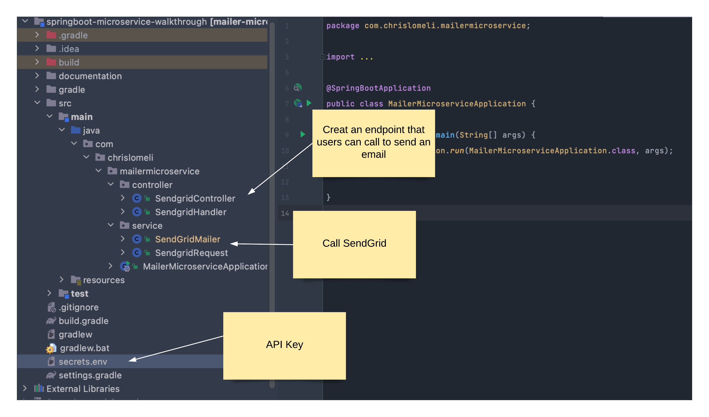

The code for this microservice is a simple textbook REST service.  This is a simple blocking service so that we can explore a simpler paradigm.  Later we'll build a Webflux service when we build the Event Activity service.   Here's the basic outline of the solution:



---


**The client request**

The client request is the input to the microservice REST API.  It's a simplified json record with the basic requirements for sending emails.  Any additional information required to build a SendGrid request are stored as configurations

```javascript
POST /email/v2/send HTTP/1.1
Host: localhost:5000
Content-Type: application/json
Content-Length: 269

{
  "senderName": "me",
  "fromAddress": "sender@gmail.com",
  "toAddress": "receiver@gmail.com",
  "subject": "This is my email",
  "content": "Click here to create a click event: http://www.google.com",
  "customArgs": {
    "mycounter": 60000
  }
}
```

---

#### The Controller

The controller is a simple rest service that our client calls. It handles the client request by passing it on to the main program and returning the final result back to the client.


```java
/*
   You will often see examples where the Java object is passed as an object:
   
   * ResponseEntity<String> handleRequest(@RequestBody SendgridRequest mailRequest)
   
    letting Spring handle the json conversion implicitly - but some teams don't do it that way, preferring to 
    pass in the json string and manage the conversion
*/
@PostMapping(path = "/send")
public ResponseEntity<String> handleRequest(@RequestBody String mailRequest)  {
    HttpHeaders responseHeaders = new HttpHeaders();
    responseHeaders.set("Content-Type", "application/json");
    
    try {
         String result =
                    controllerFacade.requestHandler(mailRequest);
        return ResponseEntity.ok()
               .headers(responseHeaders)
               .body(result);
   } catch (Exception e) {
            return ResponseEntity.badRequest()
             .headers(responseHeaders)
            .body(e.getLocalizedMessage());
    }
 }
```


---

#### The Handler

The handler function is just a pass-through - it's only function is to convert from a json string to a `SendgridRequest` Object and to provide a final catch for any errant runtime exceptions.
The design paradigm is that everything returning to the caller is in the form of a valid `Response` object.

```java 
public Response requestHandler(String jsonString) throws IOException {

    try {
        //---convert json ----
        SendgridRequest mailRequest = objectMapper.readValue(jsonString, SendgridRequest.class);

        //--- pass to Sendgrigmailr
        var response  =  sendGridMailer.send(mailRequest);

        // ---- handle bad response and return ---
        if (response == null)
            throw new NullPointerException("mailer returned unexpected null");
        return  response;
    } catch (JsonProcessingException |  IllegalArgumentException ex) {
        return new Response(HttpStatus.BAD_REQUEST.value(), ex.getMessage(),
                Map.of("Content-type", "application/json", "X-Source", "json-format"));
    }  catch (Exception ex) {
        return new Response(HttpStatus.INTERNAL_SERVER_ERROR.value(), ex.getMessage(),
                Map.of("Content-type", "application/json", "X-Source", "application-error"));
    }
}


```

---

#### The Mailer

The SendGridMailer send\(\) method takes the user's request and:

* [x] Creates a SendGrid Mail object
* [x] Creates a SendGrid Request containing our new Mail object
* [x] Sends the Request to the SendGrid API
* [x] Receives a Response back


```java
public Response send(SendgridRequest mailRequest) throws IOException {
    
    // Create a SendGrid Mail object
    Mail mailer = createSendGridMail(mailRequest);

    // Create a SendGrid Request
    final Request request = new Request();
    request.setMethod(Method.POST);
    request.setEndpoint("/" + apiVersion + "/" + "mail/send");
    request.setBody(mailer.build());
    request.setBaseUri(this.host);
    request.addHeader("User-Agent", "sendgrid/" + apiVersion + ";java");
    request.addHeader("Authorization", "Bearer " + apiKeyValue);
    request.addHeader("Accept", "application/json");

    // Send to the SendGrid API
    try {
        return client.api(request);
    } catch (Exception e) {
        return new Response(HttpStatus.BAD_GATEWAY.value(), e.getMessage(), request.getHeaders());
    }
}

```


**SendGrid Response**

SendGrid will respond with an httpStatus code and any message in the body.  It will aslo include a list of headers

```javascript
{
  "statusCode": 202,
  "body": "",
  "headers": {
    "Strict-Transport-Security": "max-age=600; includeSubDomains",
    "Server": "nginx",
    "Access-Control-Allow-Origin": "https://sendgrid.api-docs.io",
    "Access-Control-Allow-Methods": "POST",
    "Connection": "keep-alive",
    "X-Message-Id": "tspnajLkRPKN_J6WgS-Dcg",
    "X-No-CORS-Reason": "https://sendgrid.com/docs/Classroom/Basics/API/cors.html",
    "Content-Length": "0",
    "Access-Control-Max-Age": "600",
    "Date": "Mon, 19 Jul 2021 14:31:23 GMT",
    "Access-Control-Allow-Headers": "Authorization, Content-Type, On-behalf-of, x-sg-elas-acl"
  }
}
```

