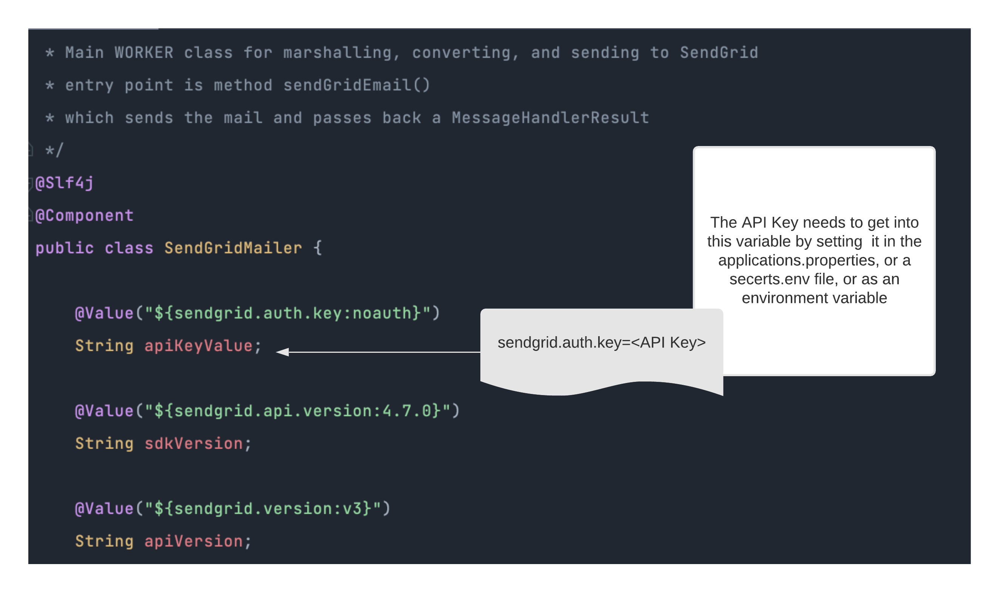
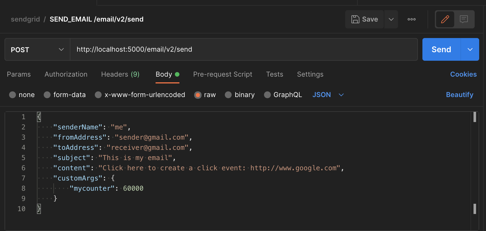

### Getting SendGrid

SendGrid is a good choice for our example because it has a free tier, and a well-documented API that we can creat a client for as well as a webhook that we can provide a service for.

As a client, we send email requests to SendGrid.  SendGrid will send our emails to customers and will call our webhook service with additional information about how the recipient of the email reacted to the email.  Whether the email bounced or was received, whether the recipient opened the email or clicked on a link that we provided in the email.

#### What you'll need
In order to run the code for ourselves we need to

* [ ] create a sendgrid account
* [ ] create an API key for the sendgrid account
* [ ] download or clone the repository
* [ ] export the API key property as **sendgrid.auth.key**
* [ ] be able to use Postman or curl to send a user request

####Create a SendGrid account
Create a new account by visiting the SendGrid site and signing up.  We won't spend a lot of time setting up the account - the instructions provided by SendGrid are easy to understand. 

```
https://docs.sendgrid.com/
```


 Read the excellent SendGrid documentation to get your account set up



####Create an API key
Once we've created our account we'll need to create the API key that we'll use to authenticate with SendGrid.  This process is documented in the docs here:

```text
https://docs.sendgrid.com/ui/account-and-settings/api-keys
```

Log into your SendGrid account and add the API key per the instructions provided there


#### Use the API Key

The API Key needs to be inserted as a value in the SendGridMailer.



There are a few ways to do this.  Setting up spring boot configurations is beyond the scope of this walkthrough, but generally:

* place it into the application.properties resource file
* declare it as an Environment variable
 * on the command line, or
 * in an ".env" file

```
sendgrid.auth.key="<my api key>"
```

#### Run the service

* [ ] Start the microservice locally
* [ ] If you are using the application.properties file - then you will be listening on port 5000
* [ ] Use curl or Postman to send a user request



Make sure the proper headers are set !  Content-type should be 'application/json'

```javascript
POST /email/v2/send HTTP/1.1
Host: localhost:5000
Content-Type: application/json
Content-Length: 269
```


