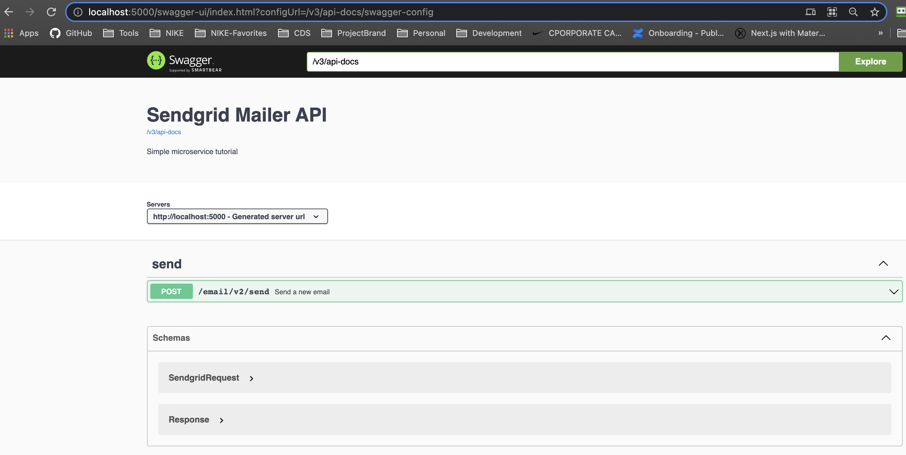

One of the first things we want to do with a microservice is document the contact for any potential users.  
> We have to publicly document our shared APIs

Every organization will have its own way of doing that, but one common approach is to use Open API as a documenting tool for the API itself.

## The Open API standard

This standard should be well-known to any microservice developer, and I won't go into the history or the background.  As a demonstration - I'll provide an example of an open API 3.0 implementation.  Every org is different through - some don't want to see this code in the final compilation, some want to keep it separate from the code.  This is an example where the API documentation is in the code and the runtime can be turned on or off based on a feature toggle.


First lets go through the steps we take to add open api to the sendgrid mailer. 

---

### OpenAPI Setup

**Add the Maven/Gradle dependency**
```text
    // OpenAPI
    implementation group: 'org.springdoc', name: 'springdoc-openapi-ui', version: '1.5.10'
```

**Add the OpenAPI Bean**

Add the bean to a configuration 

```java
    /* the bean annotation */
    @Bean
    
    /* the feature flag */
    @ConditionalOnProperty(prefix = "feature.toggle", name = "openapi", havingValue="true")
    
    /* the Bean */
    public OpenAPI customOpenAPI() {
        return new OpenAPI()
                .components(new Components())
                .info(new Info().title("Sendgrid Mailer API").description(
                        "Simple microservice tutorial"));
    }

```

**Add Endpoint Annotations**

What we are doing is annotating the API endpoints and objects in the code itself.

For each endpoint we add the documentation for that endpoint as a set of annotations
* @Operation  - to identify the endpoint
* @ApiResponses - to document what kind of responses we should expect to get
* @Parameter - to document the inputs to the endpoint

example for the handleRequest() endpoint

```java
@Operation(summary = "Send a new email", description = "See the Sendgrid documentation for the Response object", tags = { "send" })

@ApiResponses(value = {
        @ApiResponse(responseCode = "200", description = "Request was processed (the actual return code is in the Response::statusCode") })

@PostMapping(value = "/send", consumes = { "application/json" })
public ResponseEntity<Response> handleRequest(
        @Parameter(
            description="Simple Email request", 
            required=true, 
            schema=@Schema(implementation = SendgridRequest.class))
        @RequestBody String mailRequest) {
        
        ...

}
```

**Optionally add Schema Annotations**

Its optional to update the data pojos - the Open API documentation will automatically find and document them.  For example - the SendGrid Response object is documented even though it's not in our source code.  But if we want to communicate a little more than just names and storage types -- we can do that with annotations.    

example annotations for the SendgridRequest class
```java 
@Data
@AllArgsConstructor
@NoArgsConstructor
@Builder
public class SendgridRequest  {
    @Schema(description = "Sender name", required = true)
    String senderName;

    @Schema(description = "Email address of the sender", example = "me@gmail.com", required = true)
    @Email
    String fromAddress;

    @Schema(description = "Email address of the recipient", example = "you@gmail.com", required = true)
    @Email
    String toAddress;


    @Schema(description = "Email subject", required = true)
    @NotBlank
    String subject;

    @Schema(description = "Email body", required = false)
    String content;


    @Schema(description = "Properties that Sendgrid will return to us in event activity", required = false)
    private Map<String, String> customArgs;
}
```

### Open API JSON Definition 

**The Specification**

Once we make the changes above - we can start up our service and call:
```text
GET /v2/api-docs HTTP/1.1
Host: localhost:5000
Content-Type: application/json
```
example
```http request
http://localhost:5000/v3/api-docs
```

<detail>

And we'll get the complete Open API Json definitions for our API - in this case we only document a single endpoint.

```json
{
  "openapi": "3.0.1",
  "info": {
    "title": "Sendgrid Mailer API",
    "description": "Simple microservice tutorial"
  },
  "servers": [
    {
      "url": "http://localhost:5000",
      "description": "Generated server url"
    }
  ],
  "paths": {
    "/email/v2/send": {
      "post": {
        "tags": [
          "send"
        ],
        "summary": "Send a new email",
        "description": "See the Sendgrid documentation for the Response object",
        "operationId": "handleRequest",
        "requestBody": {
          "content": {
            "application/json": {
              "schema": {
                "$ref": "#/components/schemas/SendgridRequest"
              }
            }
          },
          "required": true
        },
        "responses": {
          "200": {
            "description": "Request was processed (the actual return code is in the Response::statusCode",
            "content": {
              "*/*": {
                "schema": {
                  "$ref": "#/components/schemas/Response"
                }
              }
            }
          }
        }
      }
    }
  },
  "components": {
    "schemas": {
      "SendgridRequest": {
        "type": "object",
        "properties": {
          "senderName": {
            "type": "string"
          },
          "fromAddress": {
            "type": "string"
          },
          "toAddress": {
            "type": "string"
          },
          "subject": {
            "type": "string"
          },
          "content": {
            "type": "string"
          },
          "customArgs": {
            "type": "object",
            "additionalProperties": {
              "type": "string"
            }
          }
        },
        "description": "Simple Email request"
      },
      "Response": {
        "type": "object",
        "properties": {
          "statusCode": {
            "type": "integer",
            "format": "int32"
          },
          "body": {
            "type": "string"
          },
          "headers": {
            "type": "object",
            "additionalProperties": {
              "type": "string"
            }
          }
        }
      }
    }
  }
}
```
</detail>

### The Swagger UI

If we go to the following url while our service is running we'll be able to see the classic "Swagger" API documentation.

```http request
http://localhost:5000/swagger-ui.html
```




