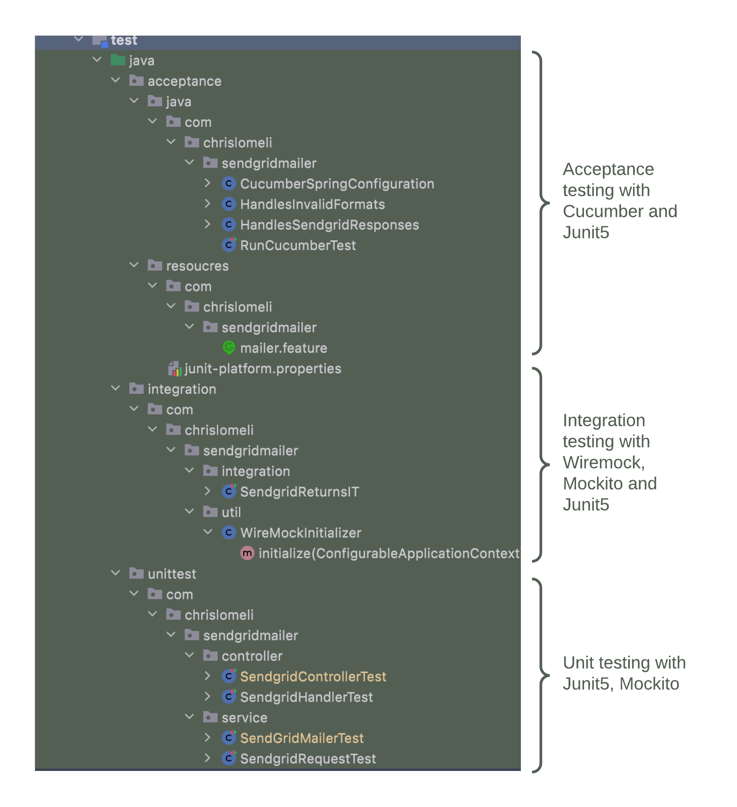

# Kinds of tests

* [x] **Unit testing** - we test each component in the system for all possible inputs and outputs
* [x] **Integration testing** - we test overall functionality of a logical group of components 
* [x] **Acceptance testing** - business users can create tests or verify that business requirements have been met
* [x] **Performance testing** - we stress-test the system for scalability using ... [TBD] Gatlin?

Let's create a few examples of each of these type in the following sections.   


As usual, the code is here: [Get the code](https://github.com/tiny-engines-code/springboot-microservice-walkthrough)


The test directory of this project contains sample code for unit-tests, integration test and acceptance tests:

