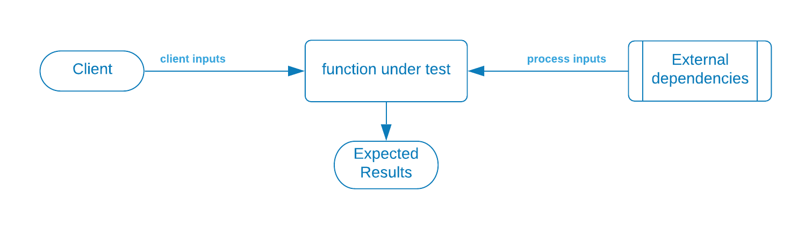

## Unit testing 

Effective unit testing starts with modular code design.  Of course that's much easier in a textbook example like this, but the really key functions should be able to define a simple set of inputs and the expected outputs for those inputs.  

<strong>For each "function" under test</strong>

* This is usually a single method

<strong>What are the inputs to the function?</strong>

* List the input parameters that the unit can be called with
* List external inputs that the function depends on

<strong>What are the expected results?</strong>

* For each set of inputs, what is the expected response?

