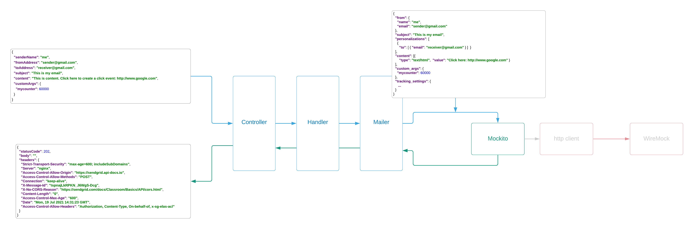
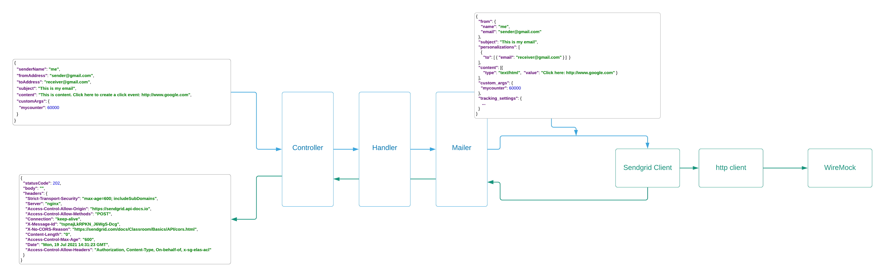

# integration testing

The goal of integration testing is to test more of the overall functionality of the solution.  Unlike unit testing, our goal is to verify that the "units" of the solutino work together to meet a business requirement

The environment
For integration testing we are using
* Wiremock to mock the SendGrid API
* This allows all of our code to be testing as a single unit
* Because this is a simple service - that's arguably adequate for the service if we use parameterized scenarios to mimic the various 
* The rationale there is that:
  * We have already tested how the solution handles input data al the way up to the Sendgrid Client object that calls the Sendgrid API
  * We don't need to integration-test the SendGrid Client itself for those input scenarios
  * It's more important that we focus on the way we respond to output from the SendGrid API

Let's get to it.
At the time of writing, the Junit5 / Wiremock integration is a little tricky - so we'll spend a few moments discussing it.

**Lets take another look at the ed to end flow for the Sendgrid mailer service, adding in more detail on the components that SendGrid supplied.

---
####End to end view
* [x] Sendgrid supplies the Client we are using to do the actual http send to the SendGrid API.
* [x] For this example the http client is also supplied by SendGrid (although we could inject our own)
* [x] The http client makes the remote call to the SendGrid API

---
####Unit test view
When we were unit testing we tested all the components ***individually***.  Piecing all of the those individual tests together we get all the way from the start to the final call the SendGrid client.  We were looking for the way our code would respond to different inputs - we were not trying to test SendGrid's code.  And we did not want to actually call SendGrid and send a real email.  

So at the last step - we replaced the SendGrid Client with Mockito mock of the Client and -- under the covers -- our mock was called instead of the Client  

---
####Integration view
Now we want to test all our components together as a whole, and cover as much of the end to end functionality as possible, but we still don't want to actually call SendGrid and send a real email, and we want to create scenarios that would be difficult to re-create with a real production API.

So we use Wiremock to "mock" the SendGrid API.  Wiremock provides the capability to return anything th SendGrid API might return without having to set up each specific scenario.  And we won't ever accidentally call the real API and send an email.

