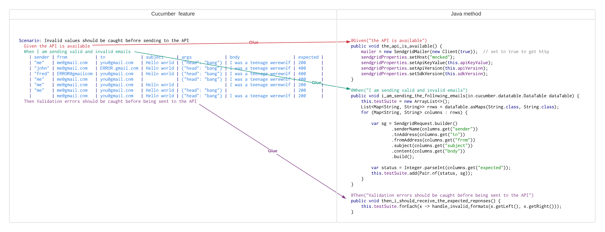
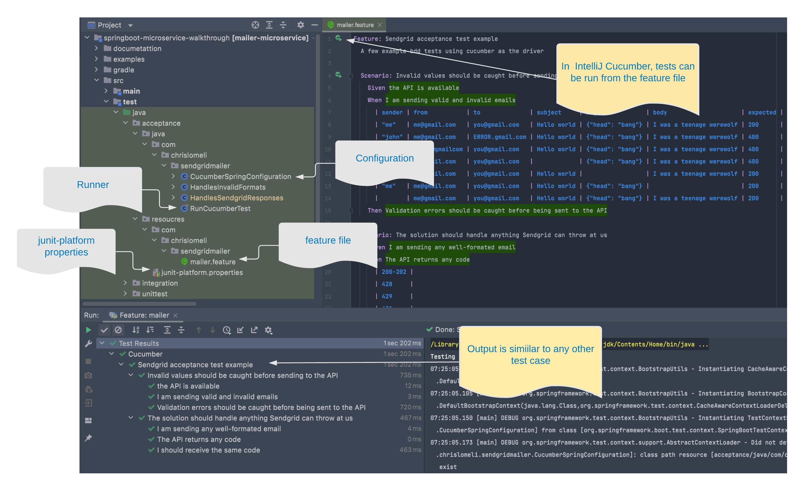

# acceptance testing

### What's the value
The idea with what I'm calling acceptance testing is that we are providing some validation to business stakeholders that a given solution is meeting the business goals of the company.  Some feel that a more conversational language for generating and evaluation test cases will help us meet that goal.  BDD (Behavioral Driven Development) is an oft used approach to achieving that, and there are several frameworks that support BDD.  Cucumber is one such framework.  The "language" part of BDD frameworks is often Gherkin.

Is BDD (Behavioral Driven Development) a new way of testing, or yet another testing framework?  I think it can be both depending on how it's used.

If there's organizational support to develop documentation before build and foster a tight cooperation between business users and software engineers  then the promise of BDD could be realized.  That being said, it seems to me that many companies who create software are moving in the opposite direction and for those, a simple framework would not bridge the gap.

If BBD is not a set of behaviors supported in the organization - then it's just another testing framework.  Honestly, all Java test frameworks allow us to accomplish adequate tests and any of the available frameworks (testNG, Juint, Mockito, Spock) will work just fine.  What really separates great testing is designing a well-designed and complete set of tests.

So, if a team simply loves the way BDD tests are developed and can be efficient in creating an overall test approach, then they should use BDD.  It is fun to see these tests working.  Or if the team feels that the promise of a shared language that brings requirements closer to code is inpiring enough to devote their energies to -- then that's how great things sometimes happen.

We'll use the Cucumber framework for this example of BDD.   The basic idea is that there's a very opinionated way to declare a test. 
* [x] **GIVEN** - is for defining the logical precondition or state 
* [x] **WHEN** is for defining an action
* [x] **THEN** is for defining the expected or desired state after the action takes place
* [x] **AND** is for adding conditions or states to any of the above


As an example,

```gherkin
Scenario: Happy path email delivery
    Given that I want to send email to a valid recipient
    When I fill out a simple email form correctly
    And I send it to our new application
    Then I expect that an email request will be sent to SendGrid
    And I expect that the email will be delivered to the recipient
```

Cucumber scenarios are stored in files with the .feature extension.  Cucumber wires these statements to the code that implements the actual transitions using Java, Junit, any and all the tools we've used so far.



```
Feature: Sendgrid acceptance test example
  A few example bdd tests using cucumber as the driver

  Scenario: Invalid values should be caught before sending to the API
    Given the API is available
    When I am sending valid and invalid emails
      | sender | from           | to              | subject     | args             | body                     | expected |
      | "me"   | me@gmail.com   | you@gmail.com   | Hello world | {"head": "bang"} | I was a teenage werewolf | 200      |
      | "john" | me@gmail.com   | ERROR.gmail.com | Hello world | {"head": "bang"} | I was a teenage werewolf | 400      |
      | "fred" | ERROR@gmailcom | you@gmail.com   | Hello world | {"head": "bang"} | I was a teenage werewolf | 400      |
      | "me"   | me@gmail.com   | you@gmail.com   |             | {"head": "bang"} | I was a teenage werewolf | 400      |
      | "me"   | me@gmail.com   | you@gmail.com   | Hello world |                  | I was a teenage werewolf | 200      |
      | "me"   | me@gmail.com   | you@gmail.com   | Hello world | {"head": "bang"} |                          | 200      |
      |        | me@gmail.com   | you@gmail.com   | Hello world | {"head": "bang"} | I was a teenage werewolf | 200      |
    Then Validation errors should be caught before being sent to the API


```

---
Once Cucumber has been configured properly then it can be run from gradle or directly from the Cucumber feature file.


