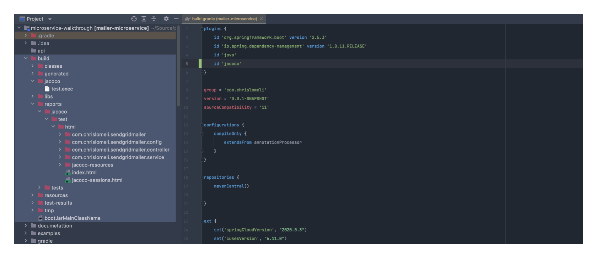
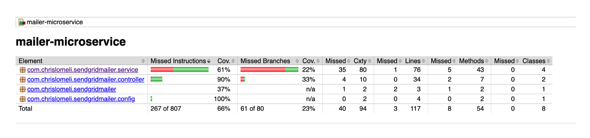
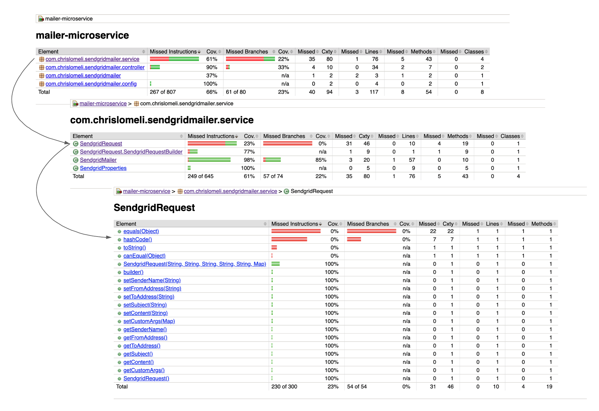
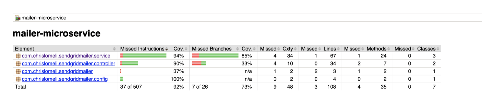
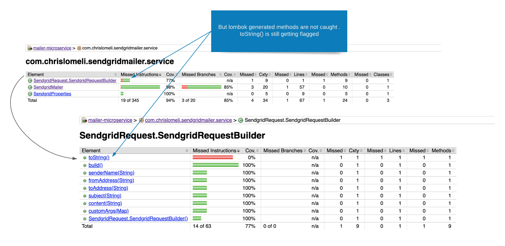
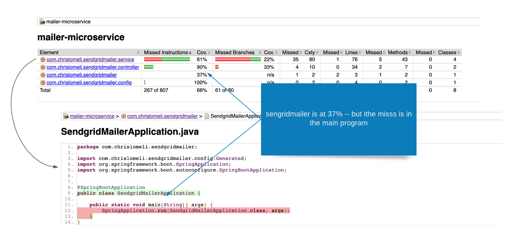
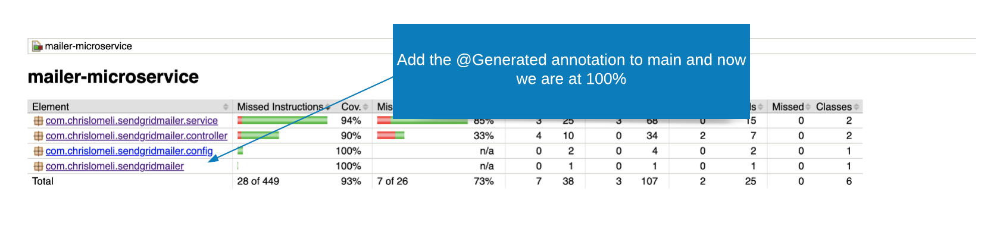
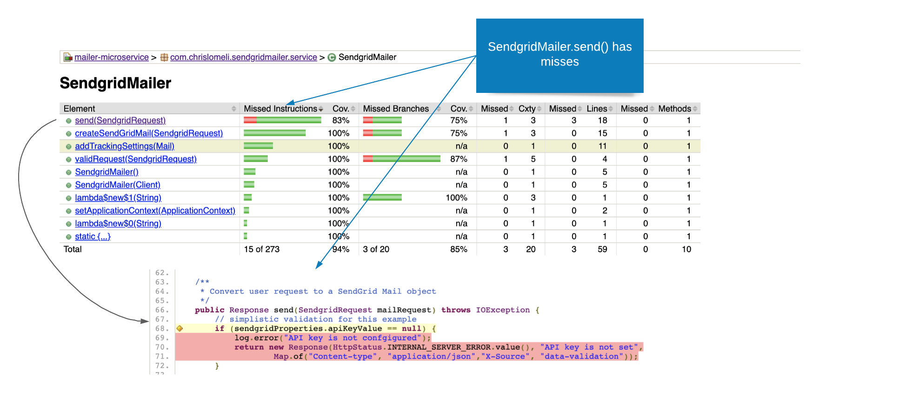
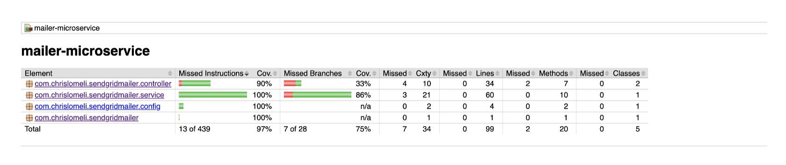
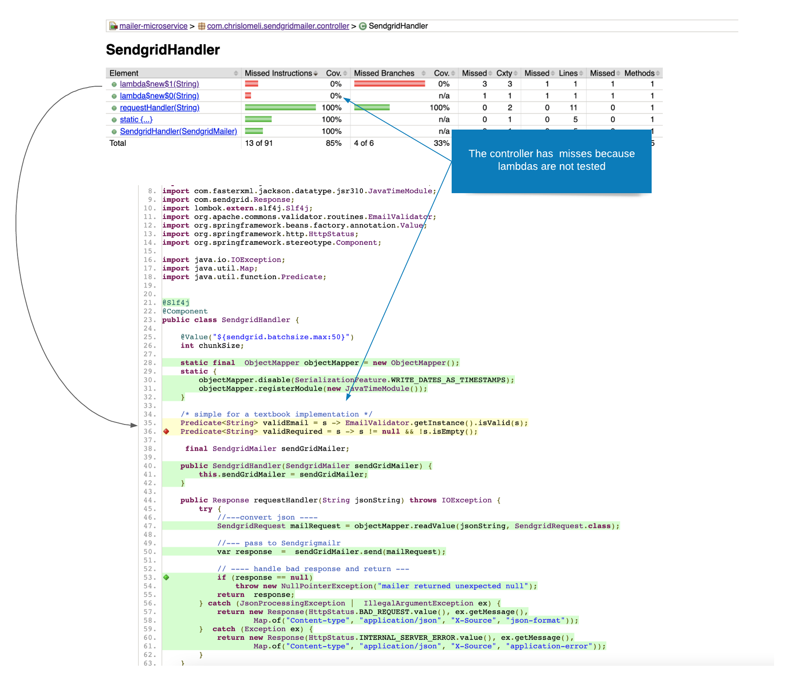

Code coverage tools measure how compresensive our automated tests are.   

We'll use Jacoco to demonstrate code coverage using the Gradle implementation.

####Setup

* [x] Step 1 - Add the jacoco plugin to the build.gradle file

```text
plugins {
id 'java'
id 'jacoco'
}
```
---
* [x] Step 2 - Run our unit test with Jacoco

```
gradle test jacocoTestReport
```

Jacoco will create a report of the coverage our test cases achieved and place it by default in the build directory.  Click on the index.html file to get to the Jacoco report for our latest test run.




---
* [x] Step 3 - Review the Jacoco report

Navigate to the directory containing the index.html and open in a browser.  We'll be presented with the Jacoco coverage report.  

We are presented with a line items for each package in our application.  For each package Jacoco shows package showsthe percentage of instructions that have been run, and the percentage of the possible logic branches that have been traversed.

In this case:
* The `sendgrimailer.service` package shows 61% of our instructions covered, and 22% of branches traversed.
* The `sendgrimailer.controller` package has 90% instructions coverage, and 33% of the possible logic branches traversed.
* The (main) `sendgrimailer` package has 37% of our instructions are covered
* The `sendgrimailer.config` package has 100% coverage




---
####Filtering methods using Gradle
Two packages we need to review in more depth are:

* the `sendgridmailer.service` is at 61% coverage, and
* the `sendgridmailer` app is at 37% coverage

Let's tackle the 61% `sendgridmailer.service` first.

Drilling into the `sendgridmailer.service`, we see that the SendgridRequest is the main culprit.  There's a difference of option on whether data classes like SendgridRequest need to be tested.   



We want to skip testing this class.   Let's do that now:

One way of skipping coverage testing is to set filters in our build,gradle file.   We'll add the following to build.gradle and rerun our test.

```groovy 
jacocoTestReport {
    dependsOn test // tests are required to run before generating the report

    afterEvaluate {
        classDirectories.setFrom(files(classDirectories.files.collect {
            fileTree(dir: it, exclude: [
                    "com/chrislomeli/**/SendgridRequest.class",
             ])
        }))
    }
}
```

After adding the filter to build.gradle we re-run our tests and review the Jacoco report:



After adding the filter we see that our overall coverage for the `sendgridmailer.service` code coverage went up to 94%.

---

####The @Generated annotation
We can also remove Jacoco coverage from any method by adding a `@Generated` annotation to the method.  So let's create that annotation.  We'll create a generated annotation like so:

```java
@Documented
@Retention(RUNTIME)
@Target({TYPE, METHOD})
public @interface Generated {

}
```
---
####Filtering Lomobk methods
After adding the filter we saw that our overall coverage for the `sendgridmailer.service` code coverage went up to 94%.  That's great, but drilling into the service we see that SendgridRequest is still reporting misses.   

It looks as if we skipped the equals() and hashCode() functions, but the toString() method is still reporting misses.  What's going on?



A quick look at the SendgridRequest shows us that there is no explicit **toString()** function -- it is being created by lombok -- and it's clear that Jacoco can't see these generated methods.

But wait -- with a Lombok method there's no obvious place to put a @Generated annotation on.  So how can we annotate a method we can't see?    

Well ... we can't.  

We'll use the @Generated annotation later, but for Lombok methods we do something a little different -- we tell Lombok to add the annotation for us by creating a lombok.cong file in our root directory and use that to tell lombok to add a @Generated annotation to the lombok-generated methods.  

Our lombok.config file has the entry:

```text
lombok.addLombokGeneratedAnnotation = true
```
and that does the trick.  Our next test run report shows that the SendgridRequest has completely dropped from the report.


---
#### Revisiting the @Generated annotation

Let's focus on the next issue in the report  -- the `sendgrid.mailer` line item is showing a 37% coverage.  Drilling down from that line shows that jacoco is complaining that we have no coverage on our main method.   We want to skipp that item as well.



We could skip the main method using the gradle filter we created earlier, but this is a great opportunity to demo the @Generated annotation we created but were not able to use. We'll add the annotation and re-run our tests.

```java 

@SpringBootApplication
public class SendgridMailerApplication {

    @Generated
    public static void main(String[] args) {
        SpringApplication.run(SendgridMailerApplication.class, args);
    }
}

```

After rerunning, we get the result we want.   The overall `sendgridmailer` line item is now up to 100% coverage.



---

####Adding more tests

Let's take another look at the `sengridmailer.service`  -- it's looking pretty good at 94%, but when we drilling, we see that SendgridMailer service has a method that should be tested.   



This a valid miss, and we don't want to skip it - we want to add a test to improve our coverage.  We add the test that coverd the missed code and re-run our tests.

```java 
    @Test
    void validates_null_key_returns_500() throws IOException {
        // mock the API
        lenient().when(sendGridClient.api(any(Request.class))).thenReturn(new Response(HttpStatus.OK.value(), "{}", null));

        // create an input sendgridRequest based on the parameterized values passed in and set properties
        var mailer = new SendgridMailer(sendGridClient);

        // call SendgridMailer::send
        var response = mailer.send(
                SendgridRequest.builder()
                        .senderName("any name")
                        .toAddress("any@gmail.com")
                        .fromAddress("any@gmail.com")
                        .subject("Any")
                        .content("any")
                        .build());

        // verify the expected stats code
        assertThat(response.getStatusCode()).isEqualTo(HttpStatus.INTERNAL_SERVER_ERROR.value());

        // if the status code is OK, then we should have caled the API
        //   - otherwise we should have returned early and NOT called the API
        verifyNoInteractions(sendGridClient);
    }
```
After making the change we see that `sendgridmailer.service` instructions are 100% covered.   We still have some branches that are only 86% covered - but we'll stop there for now.



---
####Lambdas
Our `sendgridmailer.controller` service is also looking ok at 90% but drilling into that service we see that it's our two Predicate functions that support our simplistic validation function.



The "punch-line" here is that we can't put a @Generated annotation on those Predicate lambdas.   We could test those lambdas directly in our test cases. but in this case we know that the validRequest() function that uses them is fully covered, and we'll make the judgement that for a simple demo we don't gain much by adding these tests.

But in production code we might add these test cases if for no other reason than they are easy enough to add, and to make our co-workers guess or ask why we did not.

```java
    /* simple for a textbook implementation */
    Predicate<String> validEmail = s -> EmailValidator.getInstance().isValid(s);
    Predicate<String> validRequired = s -> s != null && !s.isEmpty();

    public boolean validRequest(SendgridRequest sendgridRequest) {
        return validRequired.test(sendgridRequest.getSenderName()) &&
                validRequired.test(sendgridRequest.getSubject()) &&
                validEmail.test(sendgridRequest.getFromAddress()) &&
                validEmail.test(sendgridRequest.getToAddress());
    }

```
