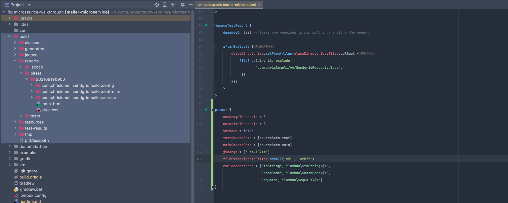
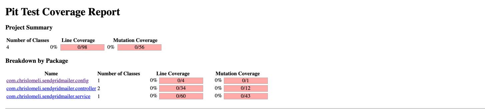

# Under construction

```groovy
plugins {
    id 'org.springframework.boot' version '2.5.3'
    id 'io.spring.dependency-management' version '1.0.11.RELEASE'
    id 'java'
    id 'jacoco'
    id 'info.solidsoft.pitest' version '1.5.1'  // add pitest
}
```

```groovy
    // pitest
    testImplementation group: 'org.pitest', name: 'pitest-junit5-plugin', version: '0.14'
    testImplementation group: 'org.pitest', name: 'pitest-groovy-verification', version: '0.32'

```

```groovy
pitest {
    coverageThreshold = 0
    mutationThreshold = 0
    verbose = false
    testSourceSets = [sourceSets.test]
    mainSourceSets = [sourceSets.main]
    jvmArgs = ['-Xmx1024m']
    fileExtensionsToFilter.addAll('xml', 'orbit')
    excludedMethods = ["toString", "lambda\$toString\$*",
                       "hashCode", "lambda\$hashCode\$*",
                       "equals", "lambda\$equals\$*"]
}
```


```shell
 gradle clean pitest
```







* remove unused predicates
* add test

```shell
   @Test
    void handles_mailer_returns_null() throws Exception {
        // when the handler calls the mailer and it throws an exception
        var sendGridMailer = mock(SendgridMailer.class);
        when(sendGridMailer.send(any(SendgridRequest.class))).thenReturn(null);
        var response = new SendgridHandler(sendGridMailer).requestHandler(createRequest());

        // then the handler witch return a valid Respose object
        assertNotNull(response);
        assertEquals(response.getStatusCode(), HttpStatus.INTERNAL_SERVER_ERROR.value());
    }


```