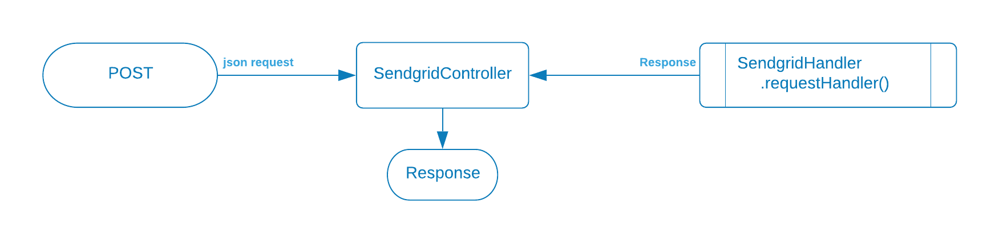

<p/><strong>The function under test</strong>

The controller receives POST requests from clients and hands them off to the 'hendler' function.
It receives a Response object from the handler and passes it back to the client as JSON.


<p/><strong>Possible Inputs</strong>

A call to the function has the following components:
* The path  \( e.g. `"/email/v2/send"\`)
* The method \(e.g. `POST`\)
* A `json` request body having a simplified email request


* The **path** can be correct or incorrect
* The method can be **POST** or an unsupported method such as GET, PUT, etc.
* The **JSON** string can be valid or invalid


<p/><strong>Possible outputs</strong>

* a Sendgrid Response object
* a Runtime exception
* a null Response object


---

#### Testing the controller inputs

First, we want to test how the controller responds to good and bad inputs.  In this is case we can establish a pattern in one unt test and then simply vary the data to extend it to other cases.  That's the case with the client input. 

We can often come up with a single pattern for several units test and vary the inputs to create our various scenarios.
In this case we'll:
- create a MockMvc call to the controller - this mimics a real call to the /send endpoint
- set the **content** that we want to test for
- expect the correct response for that content

We'll use this pattern to test:
- **Bad json** format (Something that will fail json conversion)
- **Bad path** (the client is calling a path that we do not support)
- **Bad method** (something other than POST)


```java
@Test
void handles_bad_json_format() throws Exception {

   // WHEN the client calls with  a bad json format
   var expectedStatus = HttpStatus.INTERNAL_SERVER_ERROR;
   
   // THEN expect a Response object with an internal service error
   mockMvc.perform(MockMvcRequestBuilders.post("/email/v2/send")
      .contentType(MediaType.APPLICATION_JSON)
      .content("{ \"bad }")
      .accept(MediaType.APPLICATION_JSON))
      .andExpect(result -> assertEquals("Status",
           expectedStatus.value(), 
           result.getResponse().getStatus()));
}


```


---

#### Testing the Handler outputs

The controller receives outputs from the SendGrid handler.  To test that, we'll use the same pattern as above, but we need to mock the requestHandler so that we can get the return values we want to test.

We'll use this pattern to test:
1. **Any return code** Handle any return code we get from the SendgridHandler
2. **Null return** Handle a null returning from the SendgridHandler
3. **Exceptions** Handle a runtime exception being thrown from the SendgridHandler



```java
@Test  
void handles_sendgrid_handle_exceptions() throws Exception {
  var expectedStatus = HttpStatus.INTERNAL_SERVER_ERROR;
  
  Mockito.when(sendgridHandler.requestHandler(anyString())).thenThrow(new RuntimeException("Bad juju"));
  
  mockMvc.perform(MockMvcRequestBuilders.post("/email/v2/send")
      .contentType(MediaType.APPLICATION_JSON)
      .content(content)
      .accept(MediaType.APPLICATION_JSON))
      .andExpect(result -> assertEquals("Status", expectedStatus.value(), result.getResponse().getStatus()));
}
```

