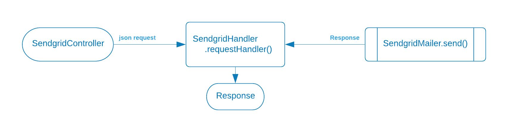

<p/><strong>The function under test</strong>

* [ ] Receives a JSON string from the SendgridController
* [ ] Calls the .send() function of the SendgridMailer class
* [ ] Returns a Sendgrid Response object as its response to the caller
* [ ] Passes the Response object back to the SendgridController


<p/><strong>Possible inputs</strong>

* The **json** can be correct or incorrect
* A "good" json string is converted to a SendgridRequest object
* A failed conversion is snet back to the client as a BAD REQUEST

<p/><strong>Possible outputs</strong>

* a Sendgrid Response object
* a Runtime exception
* a null Response object

---
#### Example - Testing the Controller request

We don't have many scenarios to cover in the handler.  The json conversion will either fail or succeed for any number of reasons.  If the conversion succeeds we pass the result to the SendgridMailer function. If it fails we want to return a BAD REQUEST.

In the example below, the handler receives a bad json string which will throw a Json exception.  The handler function should catch the exception and return a BAD_REQUEST Response object to the controller
```java
@Test
void test_handle_bad_json_input_returns_400() throws Exception {

    // when the handler's  requestHandler() method is called with bad json
    var response = new SendgridHandler(new SendgridMailer()).requestHandler("{ \"name\":\"jo}");
    
    // then it should return a BAD REQUEST Response object
    assertThat(response.getStatusCode()).isEqualTo(HttpStatus.BAD_REQUEST.value());
}
```


---
#### Example - Testing the SendgridMailer response

In the example below, the handler calls the mailer function which throws an exception.  The handler function should catch the exception and return a Response object to the controller


```java
@Test
void handles_requestHandler_exception() throws Exception {
    // when the handler calls the mailer and it throws an exception
    var sendGridMailer = mock(SendgridMailer.class);
    when(sendGridMailer.send(any(SendgridRequest.class))).thenThrow(new RuntimeException("Badd JuJu"));
    var response = new SendgridHandler(sendGridMailer).requestHandler(createRequest());

    // then the handler will return a valid Respose object
    assertAll(
            () -> assertEquals(response.getStatusCode(), HttpStatus.INTERNAL_SERVER_ERROR.value()),
            () -> assertEquals("Badd JuJu", response.getBody())
    );
}
```


