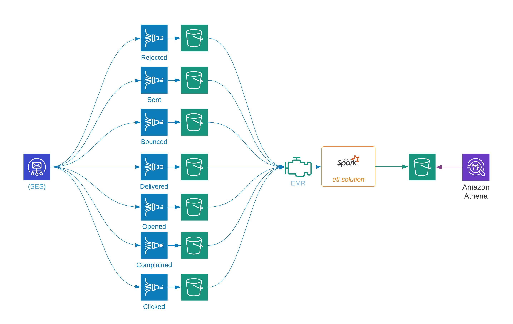

The primary components of the solution include:
* [x] a new Bucket for ses events
* [x] Create firehose streams for each event class - each going to a separate root folder
* [x] Ingest event records from AWS and store them in S3
* [x] Transform different event records into a single flat schema
* [x] Provide the ability to join that data to our own internal data

#### Data ingestion
Getting the data from AWS into our own s3 buckets is just a matter of configuration and I won't cover that part of the project.

---

####Inputs and outputs

The SES data format is a little different for each event class, so we are reading it into one "uber" `SES Input Schema` that brings the differences into our transformer as strings.  Then, we'll transform the data into a simple flat `Required Schema` output.

* [x] [SES Input Schema](schema_input.md)
* [x] [Required Schema](schema_output.md)

---

#### Data flow

* [x] The data is generated at AWS and pushed into Firehose delivery streams that we provide.  There's one delivery stream for each event class (e.g. Sent, Rejected, Bounced, Delivered, ...) and they are store in separate s3 folders.
* [x] We'll create an Apache Spark Structured Streaming solution to read the files, transform them and move them into a common bucket in parquet format.  
* [x] Once in parquet they can be processed and queried in AWS Athena, Redshift or Snowflake.

---
