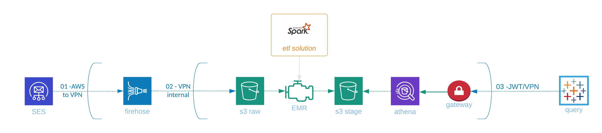

---

* [x] **01-AWS to VPN** -- AWS sends PII information from it's internal accounts into our VPN
  * data is in-flight over the Firehose delivery stream until it is stored in S3
* [x] **VPN internal** -- after storing to s3 we are inside the VPN
  * data is at rest in S3
    * bucket must be private
    * it's not required to encrypt the data
    * configure archiving 
* [x] **etl solution** -- this solution moves data inside the VPN
  * data is at rest in S3
  * EMR servers are secure
  * Standard IAM access policies should be followed
* [x] **03-JWT/VPN** -- Company users access the data across a public gateway
  * Users must be over VPN
  * Applications must provide a valida application key
  * Prevent external storage (e.g. Tableau datasets,etc.) of the data

---

