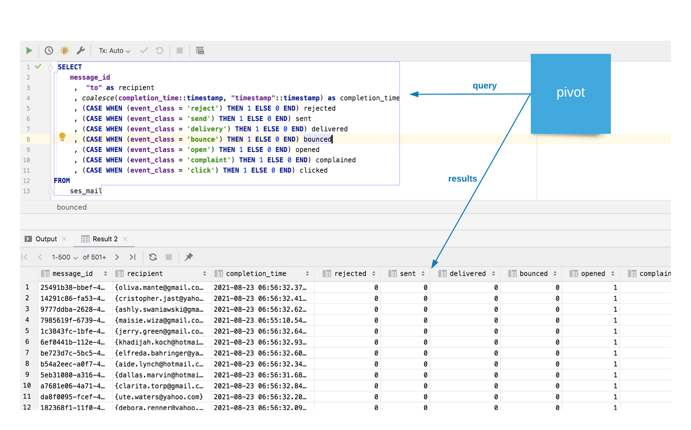
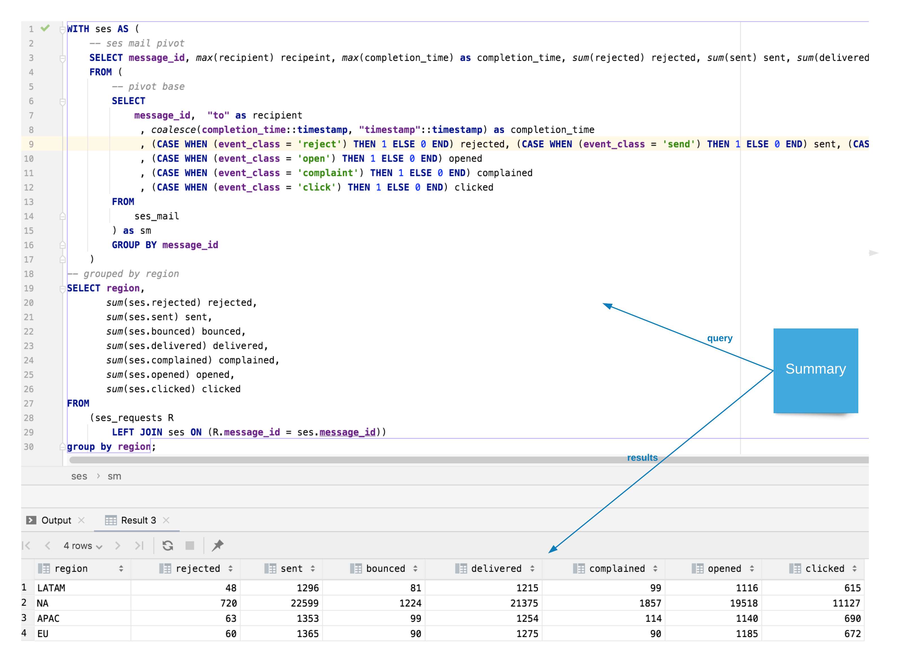
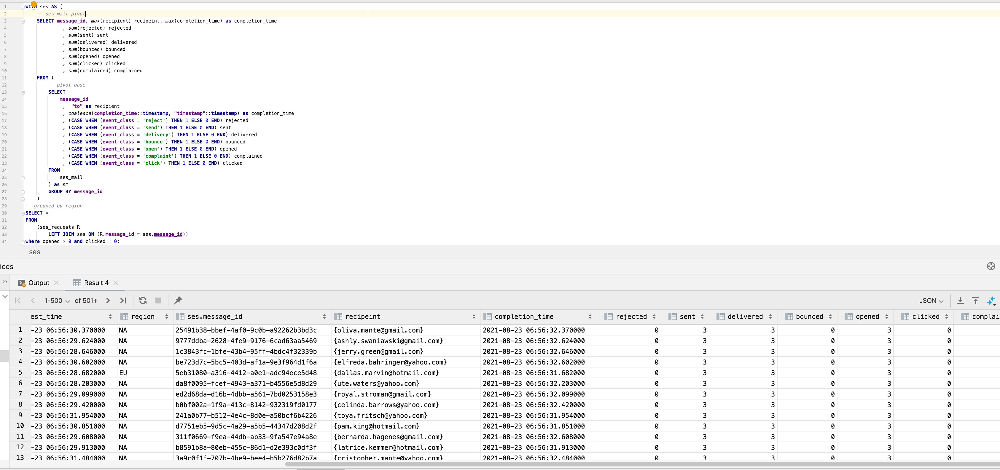

Once we have the SES events stored with the message_id as a primary key we can join it to our internal data on the same message_id key.  That allows us to meet requirements by merging exising internal data with the SES events data.

To create the proof of concept we'll generate some email data, and some sample internal data and show how thr requirement will be met.

---

#### Generate SES data
This data is generated using real data records from AWS templated so that we can change names, addresses and achieve some scenarios that we want to validate.  A sample of that data is in the "Details" drop-down below:


```json
  {
    "event_class": "open",
    "etl_time": "2021-08-23 11:32:30.209687",
    "timestamp": "2021-08-23 06:56:30.37",
    "source": "Contoso <test@contoso.mail.com>",
    "account": "742617195046",
    "message_id": "25491b38-bbef-4af0-9c0b-a92262b3bd3c",
    "from": ["Contoso <test@contoso.mail.com>"],
    "to": ["oliva.mante@gmail.com"],
    "messageId": "25491b38-bbef-4af0-9c0b-a92262b3bd3c",
    "subject": "Hello from Contoso.com!",
    "event_time": "2021-08-23 06:56:32.37",
    "event_type": "",
    "event_subclass": "",
    "event_recipients": "[]",
    "event_data": "{\"timestamp\":\"2021-08-2...130.176.17.135\"}",
    "bucket": "not-supported",
    "filename": "file:///Users/c../s3-spark-transform/input/open/open.json",
    "completion_time": "2021-08-23 06:56:32.370000",
    "ctid": "(0,1)"
  }
```


---

#### Generate internal data set
We use the identities generated above to create some mock internal data that contains a "region" field.  Our internal data has many more columns but we just need one to prove the concept.

```sql
create table IF NOT EXISTS ses_requests as (
select message_id,    -- join key
   "to" as recipient,
   (completion_time::timestamp) - (random() * 4)::int * interval '1 seconds' request_time, -- random request time
   coalesce((select ARRAY ['LATAM', 'APAC', 'EU'])[floor((random() * 20))::int],'NA') as region -- random region
  from ses_mail
);

```
a sample record

```json
  {
    "message_id": "25491b38-bbef-4af0-9c0b-a92262b3bd3c",
    "recipient": ["oliva.mante@gmail.com"],
    "request_time": "2021-08-23 06:56:30.370000",
    "region": "NA",
    "ctid": "(0,1)"
  }

```
---
#### Pivot the ses data
Because all the SES events are now in one simple data set users will be able to easily pivot across any recipients journey - for every email we send. 


---
#### Summarize by region
We can now use this to join to our internal (fake) data and the ses records to summarize over any column and across any cohort.  In this simple example we are grouping by region for the total cohort (all classes, all times)  



---
#### Create a "journey" detail

Our other requirement is to be able to trace the "journey" of a specific email including all the events it passed through in getting to the customer.  Here's an example of that kind of application.

With this query we select all the recipients who opened our email but did not click on any of our embedded links.



