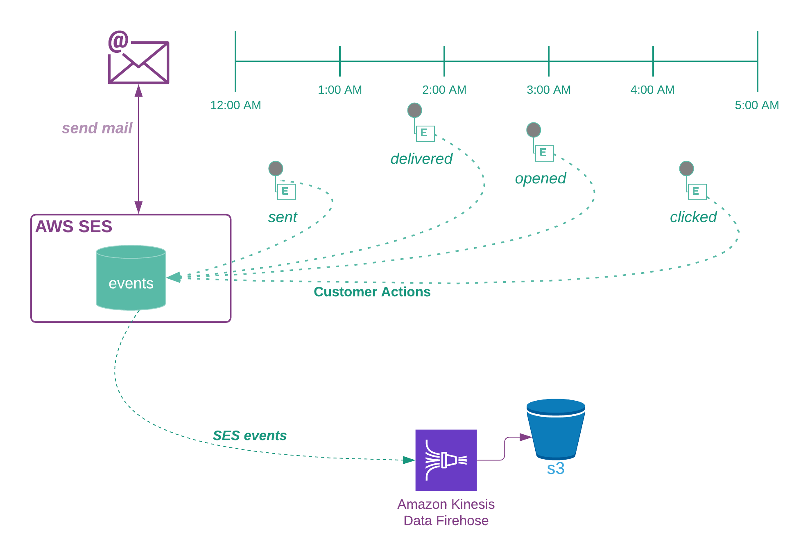

# Overview

In this walk-through we'll cover converting event records from Amazon's Simple Email Service, and transforming and loading to a local data "lake".

---
## Background
AWS sends all events of each type (e.g. bounce, delivered...) to separate Firehose delivery streams.  Each stream is configured to dump clear text json5 files to an s3 bucket. This design is for an etl solution that creates a common record format that can be pivoted across each user's events and queried in an Athena, Redshift or Snowflake (TBD)

We should be able to trace each recipient's activity across all events for a specific email
* Which user's emails, bounced, or were delivered
* Who clicked on a link in the email
* Which users complained about a specific email
* How do users' success-rates differ by region

---

