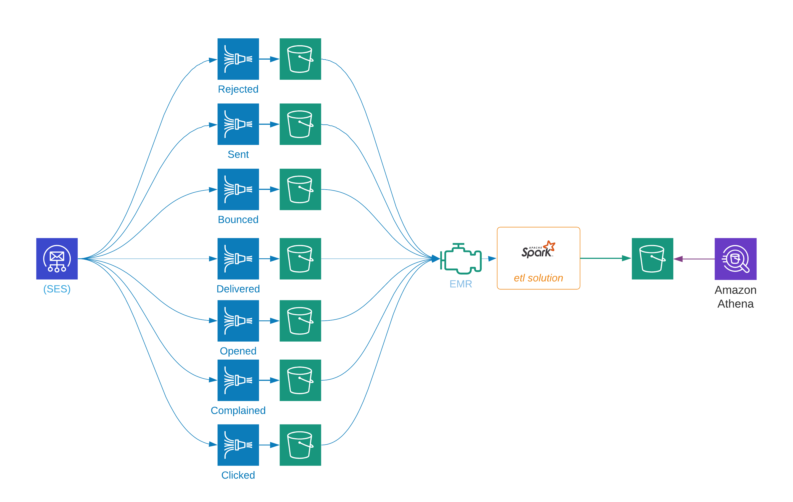

### inputs and outputs

---
Schema are expressed as Apache Spark Datasets with examples provided.
* [x] [SES Input Schema](schema_input.md)
* [x] [Required Schema](schema_output.md)

### data flow

---
SES customers can receive events records for each event that a recipient might generate.

---
* [x] Configure SES to push all activity to Kinesis Firehose delivery streams
  * each event class (e.g. delivery, bounce) requires a different stream
* [x] Create an `etl solution` using Spark Structured Streaming to
  * read all files
  * stream SES records into a common flat record schema
  * write the flat records to s3, parquet, snappy format
  * keep track of our position in the stream
* [x] If in s3/parquet, schedule near-real-time (10 minutes latency) meta-data updates

