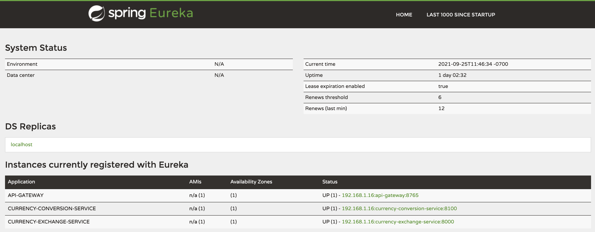
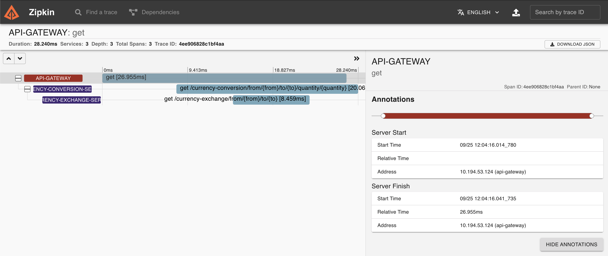

Add the following to the client

```groovy
// zipkin, sleuth
implementation 'org.springframework.cloud:spring-cloud-sleuth-zipkin'
implementation 'org.springframework.cloud:spring-cloud-starter-sleuth'


// rabbit mq
implementation 'org.springframework.boot:spring-boot-starter-amqp'
testImplementation 'org.springframework.amqp:spring-rabbit-test'
```

```
docker run -p 9411:9411 openzipkin/zipkin:2.23
```

application.properties

```
# sleuth tracing - sampling by percent 1 == 100%
spring.sleuth.sampler.probability=1
spring.zipkin.base-url=http://localhost:9411/  # optional entry - 9411 is the default
```
everything is up (and the zipkin container is also up)


- http://localhost:8765/currency-conversion/from/USD/to/INR/quantity/200
- causes trace item in Zipkin

